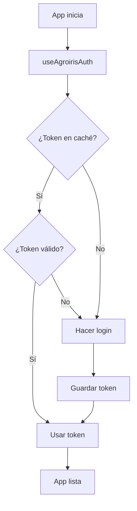

# Sistema de Autenticación AgroIris API

Este documento describe el sistema de autenticación implementado para la API de AgroIris.

## 📋 Arquitectura

### 1. Servicio de Autenticación (`agroirisAuth.ts`)

**Responsabilidades:**
- Realizar login y obtener tokens JWT
- Almacenar tokens en localStorage con información de expiración
- Renovar tokens automáticamente cuando expiran
- Proporcionar método `authenticatedFetch` para realizar peticiones autenticadas

**Características:**
- ✅ Singleton pattern para una única instancia
- ✅ Renovación automática de tokens 5 minutos antes de expirar
- ✅ Reintento automático en caso de token expirado (401)
- ✅ Parsing de JWT para obtener tiempo de expiración
- ✅ Gestión de promesas para evitar múltiples logins simultáneos

### 2. Servicio de Clientes (`agroirisClients.ts`)

**Responsabilidades:**
- Obtener lista de clientes desde la API
- Cachear clientes en localStorage (30 minutos de duración)
- Formatear clientes para uso en componentes de selección
- Búsqueda y filtrado de clientes

**Características:**
- ✅ Caché inteligente con validación de tiempo
- ✅ Filtrado por clientes activos
- ✅ Búsqueda por nombre, NIF y nombre comercial
- ✅ Formato optimizado para Combobox

### 3. Hook de Inicialización (`useAgroirisAuth.ts`)

**Responsabilidades:**
- Inicializar autenticación al cargar la aplicación
- Proporcionar estado de inicialización y errores

**Uso:**
```tsx
const { isInitialized, error } = useAgroirisAuth();
```

### 4. Componente ClientCombobox

**Características:**
- ✅ Búsqueda en tiempo real
- ✅ Muestra nombre + NIF del cliente
- ✅ Carga automática de clientes
- ✅ Estados de carga y error
- ✅ Accesible y responsive

## 🔐 Configuración

### Variables de Entorno (.env)

```env
# AgroIris API Configuration
VITE_AGROIRIS_API_URL="http://46.24.40.100:7000/api"
VITE_AGROIRIS_LOGIN_URL="http://46.24.40.100:7001/api/login/Login"
VITE_AGROIRIS_CUENTAVENTA_API_URL="http://46.24.40.100:7000/api"
VITE_AGROIRIS_CUENTAVENTA_LOGIN_URL="http://46.24.40.100:7001/api/login/Login"
VITE_AGROIRIS_LOGIN="ORIZON"
VITE_AGROIRIS_PASSWORD="ORIZON"
```

⚠️ **Importante:** Estas credenciales están en texto plano por simplicidad. Para producción, considera:
- Usar variables de entorno del servidor
- Implementar OAuth o similar
- No commitear credenciales en el repositorio

## 📦 Flujo de Autenticación



## 🔄 Renovación Automática

El sistema renueva tokens automáticamente:

1. **Validación:** Antes de cada petición, verifica si el token expira en los próximos 5 minutos
2. **Renovación preventiva:** Si está por expirar, hace login automáticamente
3. **Reintento en 401:** Si una petición falla con 401, invalida el token y reintenta una vez

## 💾 Caché de Clientes

**LocalStorage Keys:**
- `agroiris_token`: Token JWT con metadata de expiración
- `agroiris_clients_cache`: Lista de clientes con timestamp

**Duración:**
- Tokens: Según tiempo de expiración del JWT (típicamente 1 hora)
- Clientes: 30 minutos

## 🎯 Uso en Componentes

### Realizar petición autenticada

```tsx
import { agroirisAuth } from '@/services/agroirisAuth';

const data = await agroirisAuth.authenticatedFetch('/cliente/');
```

### Obtener clientes

```tsx
import { agroirisClients } from '@/services/agroirisClients';

const clients = await agroirisClients.getClients();
const client = await agroirisClients.getClientById(123);
```

### Usar ClientCombobox

```tsx
<ClientCombobox
  value={pedido.clienteid}
  onChange={(clientId) => handleChange(clientId)}
  placeholder="Seleccionar cliente..."
/>
```

## 🐛 Debugging

Para ver los logs de autenticación en consola:

```javascript
// Ver token almacenado
console.log(localStorage.getItem('agroiris_token'));

// Ver clientes cacheados
console.log(localStorage.getItem('agroiris_clients_cache'));

// Forzar nuevo login
import { agroirisAuth } from '@/services/agroirisAuth';
agroirisAuth.invalidateToken();

// Forzar recarga de clientes
import { agroirisClients } from '@/services/agroirisClients';
await agroirisClients.getClients(true); // forceRefresh = true
```

## 🚀 Mejoras Futuras

- [ ] Implementar refresh tokens
- [ ] Mover credenciales a backend
- [ ] Agregar métricas de uso de API
- [ ] Implementar rate limiting
- [ ] Agregar logs de auditoría
- [ ] Soporte para múltiples usuarios/sesiones
