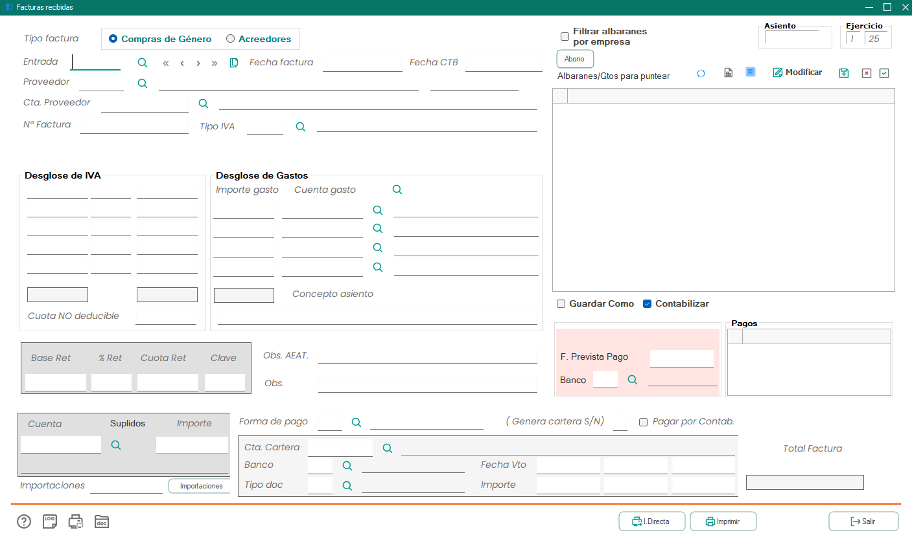
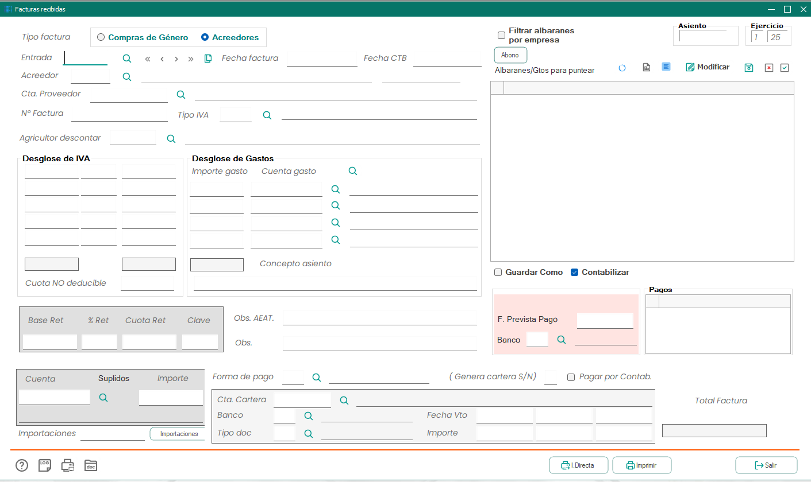
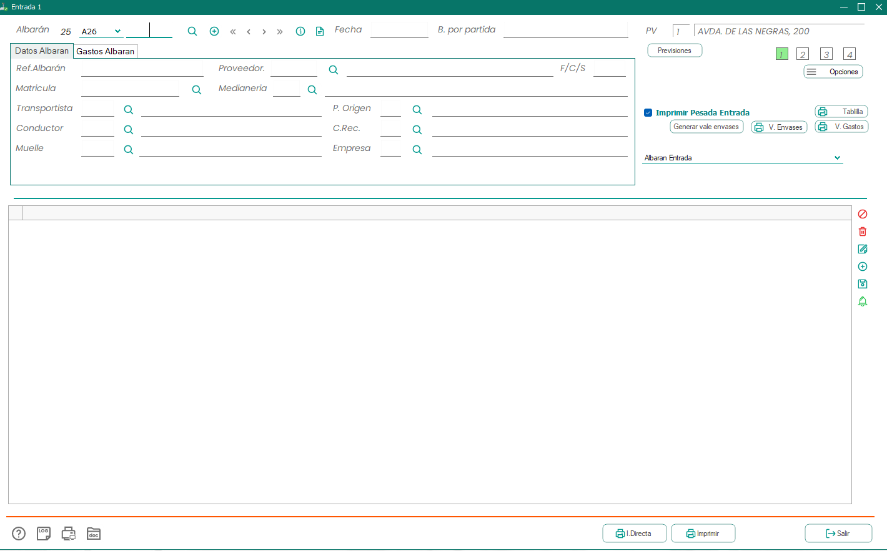
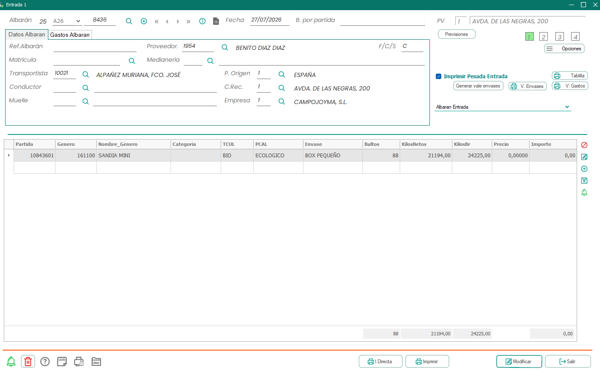

# Documentación consolidada: facturas Campojoyma

Última actualización: 2026-07-28

La topología real, los dos saltos SSH, los túneles, las rutas de claves y los
comandos de diagnóstico se mantienen en
[ACCESO_SERVIDORES_E_INFRAESTRUCTURA.md](ACCESO_SERVIDORES_E_INFRAESTRUCTURA.md).
Ese documento es la referencia operativa antes de concluir que un servidor no es
accesible o antes de medir la copia MariaDB.

La referencia canónica del contrato de escritura es
[FACTURAS_RECIBIDAS_API_CONTRACT.md](FACTURAS_RECIBIDAS_API_CONTRACT.md). El
estado de homologación y los límites de la API se documentan en
[FACTURAS_RECIBIDAS_API_V2_STAGING.md](FACTURAS_RECIBIDAS_API_V2_STAGING.md);
el OpenAPI verificable está en
[openapi/netagro-test-api-v0.2.0.json](openapi/netagro-test-api-v0.2.0.json).
El nombre del fichero se mantiene por compatibilidad; su contenido corresponde
a la API v0.2.2 desplegada y verificada mediante readback el 28/07/2026.

La API de escritura sigue en modo <code>reference_only</code>. La copia de
Netagro no expone el mecanismo oficial que crea el asiento ni permite verificar
su número y sus apuntes Debe/Haber. Una respuesta de referencia, un dry-run
correcto o un registro guardado en Supabase no significan que exista un asiento
en ERP.

Estado de aplicación a 22/07/2026: Supabase ya incorpora la finalización contra
el dry-run original, el default <code>S=false</code> de punteos y el cierre de
todos los privilegios mutantes de tabla para clientes sobre cabecera, CTB y
punteos. Tras la confirmación expresa, <code>acreedores_cache</code> se retiró
físicamente y sus cinco filas quedaron exportadas como evidencia recuperable.
Las cinco Edge Functions saneadas están desplegadas; el frontend y n8n todavía
requieren despliegue e importación remota antes de considerarse activos.

## Estado vigente

La arquitectura activa se rige por estas decisiones:

- Supabase es la bandeja de revisión. ERP es la autoridad para maestros,
  duplicados y, cuando la escritura real sea homologada, el destino final.
- Los terceros se consultan exclusivamente mediante la API ERP. El circuito
  `GE` usa `agricultores`; `OT` y los demás tipos observados usan
  `acreedores`. No existe una fuente ni un fallback local.
- Antes de enviar se repite un preflight contra ERP: existencia del proveedor
  en su maestro canónico, coincidencia de su cuenta y duplicado exacto.
- El ejercicio 25 procede de una regla explícita limitada a Onduspan (acreedor
  ERP 17). No
  se calcula a partir de la fecha de factura.
- Tipo de factura, régimen IVA y fecha CTB solo pueden venir de una regla
  aprobada para la empresa/proveedor o de una selección manual. No se deducen.
- Gastos, CTB, punteos y asiento son conceptos distintos y se almacenan,
  validan y presentan por separado.
- Los punteos son propuestas para selección manual. Solo los seleccionados
  intervienen en su total; una sugerencia nunca queda marcada por defecto.
- Un commit de estado desconocido se concilia con el <code>request_id</code> y
  el dry-run originales: solo búsqueda/readback exactos, sin repetir el POST
  escritor y sin resolver ambigüedades automáticamente.
- Los vencimientos extraídos del PDF son evidencia. No se copian
  automáticamente a <code>FechaVto</code> o <code>ImporteVto</code> sin una
  regla aprobada o confirmación manual.
- <code>acreedores_cache</code> ya no existe en Supabase. El runtime usa
  exclusivamente la API ERP y se conserva una exportación local de las cinco
  filas históricas para una recuperación controlada.

Los valores contrastados para un caso de aceptación, como ONDUSPAN
(ejercicio 25, tipo OT y régimen 2110), no son defaults universales. Solo se
aplican cuando una regla con ese alcance está aprobada.

## Confirmaciones funcionales recibidas el 28/07/2026

Campojoyma confirmó por correo que la casilla `Agricultor descontar` no se
utiliza. Por tanto, no debe mostrarse ni solicitarse en el frontend. El campo
físico <code>FRR_IdAgricultorDto</code> se conserva en el modelo y en el
contrato por compatibilidad con Netagro, con su valor neutro, pero no participa
en la edición ni se deriva de otro dato.

La respuesta incluye formularios vacíos y completos de las dos opciones
visibles bajo `Tipo factura`:

- `Compras de Género`, con la parte principal rotulada como `Proveedor`;
- `Acreedores`, con la parte principal rotulada como `Acreedor`.

Las capturas también muestran variantes distintas de
`Albaranes/Gtos para puntear`. Esto es evidencia de presentación y contenido,
no una autorización para deducir el tipo de factura desde la columna `Origen`
de un punteo. En particular, el ejemplo de acreedores contiene filas de origen
`MA`.

La segunda respuesta del mismo hilo documenta expresamente los
`Albaranes de entrada para compras de género`. Incluye el formulario vacío y
un ejemplo `25 / A26 / 8436`. La cabecera corresponde a `albentrada` y la
rejilla muestra sus partidas, género, cultivo/calidad, envase, bultos, kilos,
precio e importe. En el ejemplo existen pesos pero precio e importe son cero:
la recepción logística puede preceder a su valoración contable.

El cruce con la API y la base aclara dos dimensiones que no deben mezclarse:

- `FRR_tipofactura` representa el circuito de factura. `GE` es Compras de
  Género y resuelve el tercero en `agricultores`; `OT` y los demás tipos
  muestreados corresponden al circuito de acreedores.
- `Origen` representa la familia del albarán o gasto punteado. Una factura
  `OT` puede contener albaranes `MA`, por lo que nunca se deriva
  `FRR_tipofactura` desde `Origen`.

Las siete capturas funcionales, los hashes y la cronología saneada están en
[la carpeta de evidencias del 28/07/2026](evidencias/facturas-recibidas/actualizacion-proyecto-2026-07-28/).

## Flujo y autoridad de datos

~~~text
Frontend React
  -> archivos_pdf
  -> factura-recibida-extraer
      -> n8n campojoyma-factura-extraer
          -> IA: solo datos visibles y evidencia del PDF
          -> API ERP: acreedor/agricultor canónico y reglas confirmadas
      -> facturasrecibidas (cabecera de staging)
      -> facturasrecibidas_ctb (solo CTB explícito)
      -> facturasrecibidas_punteos (propuestas no seleccionadas)

Frontend React
  -> facturas-recibidas-erp-read
      -> n8n apiCampojoyma
          -> FastAPI
              -> copia MariaDB de solo lectura

Frontend React
  -> factura-recibida-send-erp
      -> preflight de tipo de proveedor, cuenta y duplicado contra API ERP
      -> escritor v2
      -> reference_only: no declarar asiento creado
~~~

Secuencia operativa:

1. El usuario incorpora un PDF.
2. El PDF se guarda en <code>archivos_pdf</code>.
3. <code>factura-recibida-extraer</code> envía su contenido al extractor n8n.
4. La IA extrae únicamente datos visibles; n8n busca candidatos de acreedor y
   agricultor sin mezclar sus identificadores.
5. La Edge Function normaliza y guarda cabecera, CTB explícito y propuestas de
   punteo sin seleccionar.
6. Los errores bloqueantes y avisos quedan visibles para revisión.
7. Antes del envío se consulta de nuevo ERP y se rechaza cualquier proveedor
   inexistente, cuenta incoherente o duplicado exacto.
8. Mientras el escritor continúe en <code>reference_only</code>, el resultado
   solo acredita validación/referencia, nunca la creación de un asiento.

El prompt, el parser interno <code>schema_version: 3</code>, las seis
herramientas HTTP de consulta y el procedimiento de importación saneada están
documentados en
[Agente v3 de extracción de facturas recibidas](n8n/FACTURA_RECIBIDA_EXTRACTION_AGENT_V3.md).
El contrato externo del workflow continúa siendo v2; son versiones de capas
distintas.

## API ERP de lectura

La FastAPI del VPS intermedio consulta una copia local de MariaDB con
credenciales de solo lectura. No se ejecutan operaciones DDL contra Netagro.

Base interna desde n8n:

~~~text
http://172.19.0.1:18000
~~~

Webhook externo:

~~~text
https://n8nbecarios.srv894901.hstgr.cloud/webhook/apiCampojoyma?consulta=...
~~~

En n8n el parámetro correcto es <code>query.consulta</code>. La petición
interna se forma con:

~~~text
={{ 'http://172.19.0.1:18000/' + $json.query.consulta }}
~~~

Endpoints relevantes:

| Endpoint | Uso |
|---|---|
| <code>GET /health</code> | Estado de API y conexión de lectura. |
| <code>GET /empresas</code> | Catálogo real para <code>FRR_Idempresa</code>. |
| <code>GET /empresas/{empresa_id}</code> | Detalle de empresa. |
| <code>GET /acreedores</code> | Búsqueda acotada por nombre, NIF o código. |
| <code>GET /acreedores/{acreedor_id}</code> | Detalle autoritativo del proveedor y su cuenta. |
| <code>GET /acreedores/{acreedor_id}/gastos</code> | Reglas/cuentas de gasto observadas para el acreedor. |
| <code>GET /agricultores</code> | Búsqueda de productores por nombre, NIF o código. |
| <code>GET /agricultores/{agricultor_id}</code> | Detalle autoritativo del agricultor y su cuenta. |
| <code>GET /agricultores/{agricultor_id}/gastos</code> | Reglas/cuentas observadas para el agricultor. |
| <code>GET /facturasrecibidas/tipos</code> | Códigos observados; no constituye una regla de selección. |
| <code>GET /facturasrecibidas</code> | Consulta y comprobación de duplicados exactos. |
| <code>GET /facturasrecibidas/{factura_id}</code> | Cabecera real por <code>FRR_id</code> con proveedor canónico. |
| <code>GET /facturasrecibidas/{factura_id}/ctb</code> | CTB real asociado a una factura. |
| <code>GET /facturasrecibidas_ctb?factura_id={id}</code> | Alias de consulta CTB. |
| <code>GET /facturasrecibidas/{factura_id}/punteos</code> | Punteos ya ligados; en GE incluye histórico de entrada de solo lectura. |
| <code>GET /albaranes/entrada</code> | Cabeceras vigentes de albaranes de género. |
| <code>GET /albaranes/entrada/{albaran_id}/lineas</code> | Detalle logístico del albarán bajo demanda. |

Los listados responden con:

~~~json
{
  "items": [],
  "limit": 25,
  "offset": 0,
  "total": 0
}
~~~

La búsqueda interactiva de terceros debe ser acotada y con debounce. Tras
seleccionar uno se consulta su detalle en el maestro correspondiente; no se
rellena desde una copia persistida en Supabase ni se acepta una coincidencia
basada solo en un ID que también pueda existir en el otro maestro.

En la API v0.2.2, listado y detalle de facturas recibidas devuelven
<code>proveedor_tipo</code>, <code>proveedor_id</code>,
<code>proveedor_nombre</code> y <code>proveedor_nif</code>, además de las
identidades específicas de acreedor y agricultor. Para
<code>FRR_tipofactura="GE"</code> el proveedor canónico es agricultor; para los
demás tipos observados es acreedor.

## Modelo y duplicados

Tablas ERP principales:

| Tabla | Papel |
|---|---|
| <code>empresas</code> | Maestro de empresas. |
| <code>acreedores</code> | Maestro de terceros del circuito de acreedores. |
| <code>agricultores</code> | Maestro de proveedores agrícolas del circuito GE. |
| <code>facturasrecibidas</code> | Cabecera real. |
| <code>facturasrecibidas_ctb</code> | Apuntes CTB reales. |
| <code>tipoagricultor</code> | Reglas contables cuando están confirmadas. |
| <code>albentrada</code> | Cabecera vigente del albarán de entrada de género. |
| <code>albentrada_his</code>/<code>albentrada_hislineas</code> | Histórico y líneas utilizados para leer albaranes GE ya ligados. |

Relaciones prácticas:

~~~text
empresas.EMP_idempresa
  -> facturasrecibidas.FRR_Idempresa

facturasrecibidas.FRR_tipofactura = GE
  -> agricultores.AGR_Idagricultor = facturasrecibidas.FRR_idproveedor

facturasrecibidas.FRR_tipofactura <> GE (tipos observados)
  -> acreedores.ACR_Codigo = facturasrecibidas.FRR_idproveedor

facturasrecibidas.FRR_id
  -> facturasrecibidas_ctb.FRC_idfacturarecibida
  -> albentrada_his.AEH_idfacturafirme

albentrada_his.AEH_idalbaran
  -> albentrada.AEN_idalbaran

albentrada_his.AEH_id
  -> albentrada_hislineas.AHL_idalbhis
~~~

La clave de duplicado funcional es:

~~~text
FRR_Idempresa + FRR_ejercicio + FRR_idproveedor + FRR_numerofactura
~~~

La comprobación debe usar los cuatro valores exactos, ignorar registros
descartados/duplicados de staging cuando corresponda y mostrar el candidato que
causa el conflicto. Una caída de API no equivale a «proveedor no encontrado»:
se trata como indisponibilidad técnica y el envío falla de forma cerrada.

## Supabase staging

Proyecto:

~~~text
CAMPOJOYMA
adbprpemmbspntbttziz
~~~

Tablas operativas:

| Tabla | Uso |
|---|---|
| <code>archivos_pdf</code> | PDF base64, hash y metadatos. |
| <code>facturasrecibidas</code> | Cabecera, estado, extracción, validación y respuesta ERP. |
| <code>facturasrecibidas_ctb</code> | CTB explícito y separado. |
| <code>facturasrecibidas_punteos</code> | Propuestas de punteo y selección manual. |
| <code>public.facturas_recibidas_erp_rules</code> | Reglas aprobadas con alcance de empresa/proveedor. |

<code>acreedores_cache</code> se retiró físicamente el 22/07/2026 después de
eliminar sus dependencias de runtime y recibir aprobación expresa. La migración
<code>20260722190000_retire_acreedores_cache.sql</code> deja el cambio
reproducible. La exportación previa está en
<code>docs/evidencias/facturas-recibidas/acreedores-cache-backup-2026-07-22.json</code>
y su SHA-256 es
<code>79F49160CA74A3B2CAE88C026627B258FB10D69F27B38B7EB28E389152E4B5BC</code>.

Estados principales:

| Estado | Significado |
|---|---|
| <code>pendiente_revision</code> | Faltan datos o existe una revisión manual pendiente. |
| <code>validada</code> | Supera las validaciones de preparación, no implica asiento. |
| <code>duplicada</code> | Conflicto confirmado por PDF o clave funcional. |
| <code>enviada_erp</code> | Solo válido tras una creación real confirmada por ERP. |
| <code>error_erp</code> | El envío/preflight no pudo completarse. |
| <code>descartada</code> | Registro excluido manualmente de staging. |

Los identificadores <code>FRR_id</code>, <code>FRR_numero</code>,
<code>FRC_id</code> y <code>FRC_idfacturarecibida</code> deben permanecer
nulos hasta que el ERP confirme una escritura real.

## Responsabilidades de las Edge Functions

### factura-recibida-extraer

- Lee el PDF almacenado y llama al extractor.
- Guarda la cabecera normalizada.
- Guarda CTB únicamente si el origen devuelve apuntes explícitos y trazables.
- Guarda propuestas de punteo sin seleccionarlas.
- No fabrica fecha CTB, tipo, régimen, cuenta ni vencimiento.
- Devuelve estado y validaciones estructuradas.

### factura-recibida-ingest

- Recibe fuentes de email/agente o payload externo.
- Aplica las mismas reglas de normalización y validación.
- No crea una línea CTB por defecto para el flujo actual.
- Mantiene separada la evidencia de extracción de los campos ERP confirmados.

### facturas-recibidas-erp-read

Es el proxy server-side que protege el JWT. Su lista permitida incluye las
consultas concretas necesarias para empresas, acreedores, agricultores,
detalle, gastos, facturas, tipos, CTB, punteos y albaranes de entrada. No
acepta rutas arbitrarias ni navegación por segmentos.

Secrets:

~~~text
N8N_CAMPOJOYMA_READ_WEBHOOK_URL
N8N_CAMPOJOYMA_WEBHOOK_URL
N8N_CAMPOJOYMA_WEBHOOK_JWT_SECRET
N8N_CAMPOJOYMA_WEBHOOK_JWT_EXP_SECONDS
~~~

### factura-recibida-send-erp

Antes de invocar al escritor:

1. Comprueba que el proveedor existe en el maestro canónico indicado por el
   circuito: agricultor para GE y acreedor para los demás tipos observados.
2. Contrasta la cuenta de la factura con la cuenta de ese maestro.
3. Busca el duplicado exacto por empresa, ejercicio, proveedor y número.
4. Bloquea si la API no está disponible, si el proveedor no existe, si la
   cuenta difiere o si aparece un candidato duplicado.
5. Conserva el resultado <code>reference_only</code> como referencia, sin
   cambiarlo semánticamente a «asiento creado».

El escritor v2 debe repetir estas garantías antes de cualquier escritura.

## Reglas de negocio y edición manual

Las variaciones específicas no se hardcodean en frontend ni se deducen por
heurística. Se modelan en <code>public.facturas_recibidas_erp_rules</code> y deben ser
visibles/editables desde administración cuando corresponda.

Reglas vigentes:

- Empresa: se selecciona del catálogo ERP.
- Ejercicio: Onduspan (acreedor ERP 17) tiene un seed explícito con valor 25;
  no existe un default general para la empresa.
- Tipo de factura: regla aprobada o selección manual.
- Régimen IVA: regla aprobada o selección manual.
- Fecha CTB: regla aprobada o selección manual; no hereda la fecha de factura.
- Cuenta del proveedor: detalle del agricultor para GE o del acreedor para los
  demás tipos observados.
- Gastos: endpoint de gastos/regla ERP o edición explícita; nunca IA inventada.
- Vencimientos: evidencia separada hasta existir regla aprobada o confirmación.
- Agricultor a descontar: Campojoyma confirma que no se utiliza; no se muestra
  ni se solicita en la interfaz.

Los avisos informan de datos que requieren revisión. Los errores bloquean el
envío. Para un mismo campo se muestra una sola incidencia semántica.

## Separación contable obligatoria

### Gastos

Los pares <code>FRR_igasto*</code>/<code>FRR_ctagasto*</code> son desglose de
gastos de la cabecera. Proceden de reglas ERP confirmadas o de una decisión
manual explícita.

### CTB

<code>facturasrecibidas_ctb</code> contiene apuntes <code>FRC_*</code>. No son
líneas de producto, gastos ni punteos. Si no hay CTB confirmado se conserva una
lista vacía; no se construye desde la base o desde la cuenta del proveedor.

### Punteos

Las propuestas de punteo de staging son candidatos de conciliación. La
selección es manual y su estado por defecto es no seleccionado. El total de
propuestas suma únicamente candidatos marcados por el usuario; la lectura de
una factura ERP también puede devolver vínculos que ya existen.

La lectura v0.2.2 añade los albaranes GE que Netagro ya vinculó a una factura:
lee <code>albentrada_his</code> por <code>AEH_idfacturafirme</code> y, cuando
se solicitan, sus líneas desde <code>albentrada_hislineas</code>. Esas filas
son evidencia de solo lectura: no aparecen en candidatos y no pueden enviarse
en una mutación.

Cada fila GE distingue <code>importe_origen</code>, conservado del histórico,
de <code>importe_factura</code>. Si ambas bases totales no coinciden, la API
prorratea la base de factura y lo declara mediante
<code>importe_metodo=prorrateo_base_factura</code>; no sobrescribe el importe
histórico. El mayor <code>AEH_id</code> absorbe de forma determinista el residuo
de redondeo para que la suma final cuadre al céntimo.

En ASG y FGC, <code>importe_origen</code> conserva el gasto bruto e
<code>importe_factura</code> usa el importe realmente asignado a la factura
(<code>Importe P</code>).

### Asiento

El asiento pertenece al ERP y solo existe cuando el mecanismo oficial devuelve
un identificador verificable y sus apuntes. Staging, CTB propuesto, punteos,
dry-run y <code>reference_only</code> no son un asiento.

## Campos principales

| Dato | Campo | Fuente permitida |
|---|---|---|
| Empresa | <code>FRR_Idempresa</code> | Catálogo ERP/manual. |
| Ejercicio | <code>FRR_ejercicio</code> | Regla explícita (seed 25 solo para Onduspan, acreedor 17). |
| Tipo | <code>FRR_tipofactura</code> | Regla aprobada o manual. |
| Régimen | <code>FRR_idregimen</code> | Regla aprobada o manual. |
| Proveedor | <code>FRR_idproveedor</code> | Búsqueda y detalle en el maestro indicado por <code>FRR_tipofactura</code>; conservar <code>proveedor_tipo</code>. |
| Cuenta proveedor | <code>FRR_idcuenta</code> | Detalle canónico de agricultor/acreedor y preflight. |
| Número factura | <code>FRR_numerofactura</code> | PDF/IA, confirmado por usuario. |
| Fecha factura | <code>FRR_fechafactura</code> | PDF/IA. |
| Fecha contable | <code>FRR_fechactb</code> | Regla aprobada o manual. |
| Base/IVA/retención/total | <code>FRR_base*</code>, <code>FRR_iva*</code>, <code>FRR_cuota*</code>, <code>FRR_*ret</code>, <code>FRR_totalfac</code> | PDF/IA y validación aritmética. |
| Gastos | <code>FRR_igasto*</code>/<code>FRR_ctagasto*</code> | Regla ERP o manual. |
| Vencimiento | <code>FechaVto</code>/<code>ImporteVto</code> | Regla aprobada o manual. |
| CTB | <code>facturasrecibidas_ctb</code> | Solo apuntes explícitos. |
| Punteos | <code>facturasrecibidas_punteos</code> | Candidatos, selección manual. |

## Caso histórico útil: FV26-13

El caso real <code>FV26-13</code> demostró por qué no deben mezclarse gastos y
CTB ni inferirse cuentas:

| Campo | Valor |
|---|---:|
| <code>FRR_id</code> | 49174 |
| <code>FRR_idproveedor</code> | 1924 |
| <code>FRR_igasto1</code> | 15973.30 |
| <code>FRR_ctagasto1</code> | 40090001924 |
| <code>FRR_igasto2</code> | -1597.33 |
| <code>FRR_ctagasto2</code> | 60000000010 |
| <code>FRR_totalfac</code> | 14951.01 |

Los apuntes CTB observados tenían importes equivalentes, pero su coincidencia en
ese ejemplo no autoriza a copiar automáticamente un bloque al otro. La cuenta
de comisión procede de una regla de <code>tipoagricultor</code>; no se elige
mediante IA.

## Validación mínima antes del envío

- Empresa, ejercicio, proveedor, cuenta, número, fecha, tipo y régimen presentes.
- Proveedor existente en el maestro canónico ERP; no basta un ID coincidente
  en el otro maestro.
- Cuenta coincidente con ese maestro.
- Duplicado exacto inexistente en ERP.
- Importes coherentes dentro de la tolerancia definida.
- Fecha CTB confirmada por regla o usuario.
- Gastos, CTB y punteos validados en sus bloques independientes.
- API disponible durante el preflight.

Si no se resuelve un dato obligatorio, la factura permanece en revisión y el
envío se bloquea. No se sustituye un error de maestro por una advertencia ni se
usa una copia local.

## Decisiones y pendientes

Decisiones vigentes:

- La pantalla principal lista staging, no todo el histórico ERP.
- Los catálogos, acreedores y agricultores se consultan bajo demanda.
- <code>FRR_tipofactura = "1"</code> no es un valor confirmado ni un default.
- n8n extrae y contrasta; la Edge Function persiste en Supabase.
- La escritura real debe devolver identificadores ERP verificables.

Pendientes externos:

1. Homologar el mecanismo oficial de asiento y sus evidencias de lectura.
2. Confirmar las descripciones funcionales pendientes de algunos tipos.
3. Confirmar el contrato oficial de selección y mutación de albaranes GE antes
   de sacarlos del modo de solo lectura.
4. Confirmar cualquier nueva regla de tipo, régimen, fecha CTB o vencimiento
   antes de automatizarla.
5. Desplegar el frontend y reemplazar el workflow n8n tras exportar la versión
   remota vigente.
6. Completar la aceptación autenticada del flujo desplegado.

## Errores a evitar

- Usar <code>acreedores_cache</code> como fuente o fallback.
- Resolver <code>FRR_idproveedor</code> contra acreedores sin comprobar el
  circuito; los IDs de acreedor y agricultor pueden colisionar.
- Inferir <code>FRR_tipofactura</code> desde <code>Origen</code>.
- Tratar Supabase como ERP real.
- Exponer el JWT en variables de frontend.
- Cargar todo el histórico ERP en la pantalla principal.
- Inferir ejercicio desde una fecha.
- Copiar fecha de factura a fecha CTB.
- Asignar tipo, régimen o vencimiento sin regla aprobada.
- Confundir gastos, CTB, punteos o asiento.
- Seleccionar punteos automáticamente.
- Rellenar identificadores ERP antes de una escritura real.
- Declarar un asiento creado a partir de <code>reference_only</code>.
- Ejecutar DDL contra MariaDB Netagro.
