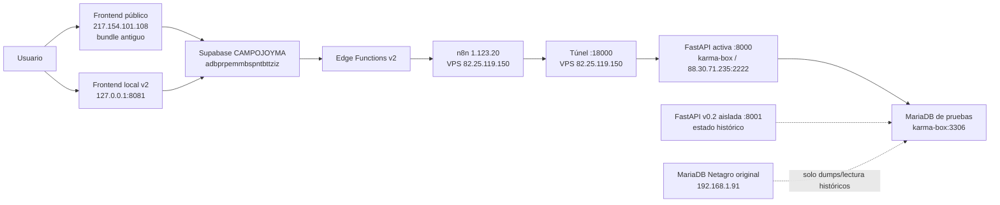

# Informe completo de relevo — Facturas Recibidas Campojoyma

**Preparado:** 17 de julio de 2026, 13:55 CEST  
**Última actualización:** 17 de julio de 2026, 14:32 CEST  
**Pensado para retomar:** lunes 20 de julio de 2026  
**Repositorio:** `campojoyma`  
**Alcance:** frontend, Supabase, Edge Functions, n8n, FastAPI, copia Netagro de pruebas, contabilidad y recorrido completo Codex/Claude.

> Este informe reconstruye todas las conversaciones relevantes en orden y contrasta su estado con comprobaciones actuales de solo lectura. No concatena las transcripciones literalmente porque varias contienen contraseñas, JWT o credenciales históricas. Conserva el contexto técnico y las decisiones, pero omite los secretos.

## 1. Resumen para leer en cinco minutos

La homologación de Facturas Recibidas v2 está **muy avanzada en código**, pero **no está terminada de extremo a extremo**.

El estado correcto es:

| Componente | Estado | Veredicto corto |
|---|---|---|
| Código frontend/Edge/Supabase | En `a3752a6`, compilable y probado | **Hecho en código** |
| Git remoto | `origin/main` y la rama v2 apuntan a `a3752a6` | **Publicado** |
| `main` local | Sigue en `2009620`, dos commits por detrás | **Hay que hacer fast-forward antes de usarla** |
| Frontend local | Versión actual accesible en `127.0.0.1:8081` | **Operativo localmente** |
| Frontend público | Sigue sirviendo el bundle antiguo `index-CJ7GZs7L.js` | **Pendiente de despliegue** |
| Acceso al host frontend | DNS confirma `217.154.101.108`; la clave disponible es rechazada | **Bloqueo de acceso** |
| Supabase v2 aditivo | Migración v2 y fallback de autenticación aplicados | **Aplicado** |
| Lockdown Supabase | No aparece en migraciones remotas; siguen políticas CRUD de navegador | **Pendiente deliberadamente** |
| Edge Functions | 6 funciones principales v2 `ACTIVE`; 2 auxiliares antiguas también `ACTIVE` | **Desplegadas, con limpieza pendiente** |
| n8n extracción | `CAMPOJOYMA - Entrada facturas recibidas ERP final` está activo | **Activo** |
| n8n escritura v2 | Existe como `Campojoyma - Facturas recibidas write v2 (DESACTIVADO)` | **Cerrado a propósito** |
| API activa | Sana, versión `0.1.0`, 40 paths/41 operaciones | **Parcialmente actualizada** |
| API v2 real | Artefacto `0.2.0` de 41 paths/42 operaciones no está publicado por el túnel | **Pendiente de promoción** |
| Repositorio API | Clon local `KarmaAgenciaGit/api-campojoyma`, `main` en `ab21689`, un commit por delante del remoto | **Separado; endurecimiento nuevo aún sin commit/push** |
| Idempotencia v0.2 | El snapshot original podía crear SQLite/tabla en la primera petición; el árbol local ya exige provisión explícita y falla cerrado | **Corregido localmente, no desplegado** |
| Albaranes `MA/albmaterial` | La API activa devuelve 0 para ONDUSPAN; deberían ser 17/21 líneas | **No operativo** |
| Lectura de asiento | `/facturasrecibidas/49305/asiento` devuelve `404` | **No operativo** |
| Escritura y contabilización ERP | Sin endpoint/readback oficial de Netagro | **Bloqueo externo** |
| Prueba PDF → IA → Supabase | No hay PDFs, borradores, revisiones ni intentos de sync en Supabase | **Nunca demostrada punta a punta** |

### Conclusión ejecutiva

No falta «una sola cosa». Hay cuatro cierres diferentes:

1. **Consolidar y promover la API v0.2 endurecida** desde su repositorio propio para soportar `albmaterial/MA` y `/asiento`, sin cambiar la estructura de MariaDB ni aprovisionar estado durante peticiones.
2. **Desplegar el frontend público** en `217.154.101.108` y comprobarlo autenticado.
3. **Probar realmente PDF → n8n → Supabase** con un documento controlado.
4. **Aplicar el lockdown** solo después de que el frontend nuevo esté verificado.

La contabilización oficial queda fuera de esos cuatro cierres: seguirá bloqueada hasta que Netagro entregue su mecanismo soportado y la lectura posterior del asiento.

## 2. Qué no debe hacerse el lunes

- No cambiar la estructura de la base Netagro de pruebas.
- No apuntar la API ni el frontend a producción «solo cambiando la URL».
- No crear el asiento mediante `INSERT` manual ni deducir las reglas contables.
- No aplicar el lockdown mientras el dominio siga sirviendo el frontend antiguo.
- No reintentar un alta ERP tras timeout sin reconciliación por `request_id`.
- No tratar `FRR_IdAsientoNet` como número visible del asiento.
- No fabricar CTB a partir de `FRR_ctagasto*`.
- No copiar ni subir a Git las transcripciones crudas de Codex/Claude.
- No hacer `reset`, borrar el worktree o eliminar migraciones para «limpiar» la historia.

## 3. Arquitectura real aclarada



Puntos que se habían mezclado en los resúmenes:

- `217.154.101.108` es el host al que apunta el DNS del frontend público.
- `82.25.119.150` es el VPS de n8n, documentación y túnel.
- La FastAPI y la MariaDB de pruebas viven históricamente en `karma-box`, accesible por `88.30.71.235:2222`.
- Consultar `http://127.0.0.1:18000` desde el VPS atraviesa el túnel y llega a `karma-box:8000`.
- Copiar `/root/netagro_docs/...` desde `82.25.119.150` descarga la copia documental del VPS; no significa que la FastAPI esté físicamente allí.

## 4. Estado actual comprobado el 17 de julio

### 4.1 Git y código local

```text
HEAD:   a3752a6 Harden factura recibida ingestion authentication
Rama:   codex/facturas-recibidas-homologacion-v2
Remoto: origin/codex/facturas-recibidas-homologacion-v2 = a3752a6
        origin/main = a3752a6
Local:  main = 2009620, detrás por 2 commits
```

Al comenzar esta auditoría, el árbol de producto estaba limpio. El working tree
actual solo contiene documentación/reglas de seguridad, la copia sincronizada del
parche API y estos dos informes; no se ha modificado código del frontend ni de las
Edge Functions.

Validaciones repetidas hoy:

| Gate | Resultado |
|---|---|
| `npm run typecheck` | Correcto, 0 errores |
| Vitest | 2 archivos, 7/7 tests |
| Tests Deno Edge | 12/12 tests |
| Build Vite | Correcto; aviso no bloqueante por chunk JS de ~809 kB |
| Bundle local | `index-CRMunZTp.js` + `index-D9xaP-8r.css` |

Nota: los primeros intentos dentro del sandbox fallaron por permisos `EPERM/EACCES`; al repetir fuera del sandbox todos los gates anteriores pasaron. No eran fallos del código.

### 4.2 Frontend público y local

- `https://campojoyma.multiplicaxfuego.com/` responde HTTP 200.
- DNS: `campojoyma.multiplicaxfuego.com → 217.154.101.108`.
- Bundle público: `index-CJ7GZs7L.js` y `index-CLWjjyd0.css`.
- Bundle v2 local: `index-CRMunZTp.js` y `index-D9xaP-8r.css`.
- La conexión `root@217.154.101.108` con la clave Hostinger disponible devuelve `Permission denied`.
- Localmente responden dos Vite:
  - `8081`: instancia levantada en la tarea actual, título `AGRO xFuego`.
  - `8080`: instancia anterior, título `AGENTS xFuego`.

No se ha hecho hoy una prueba autenticada de la pantalla v2. El hecho de que Vite responda no valida el flujo funcional.

### 4.3 Supabase CAMPOJOYMA

Proyecto comprobado mediante el conector:

```text
ID:       adbprpemmbspntbttziz
Nombre:   CAMPOJOYMA
Estado:   ACTIVE_HEALTHY
Región:   eu-west-3
Postgres: 17.6.1.127
```

Migraciones remotas presentes:

1. `add_facturas_recibidas_erp_baseline`
2. `harden_facturas_recibidas_staging`
3. `rename_erp_public_names`
4. `allow_own_factura_pdf_uploads`
5. `harden_facturas_recibidas_erp_contract`
6. `add_punteo_source_keys`
7. `homologate_facturas_recibidas_v2`
8. `add_factura_ingest_token_hash_fallback`

No aparece `lock_down_facturas_recibidas_v2`.

Estado de datos:

| Tabla/conjunto | Filas |
|---|---:|
| `archivos_pdf` | 0 |
| `facturasrecibidas` | 5 |
| Referencias `erp_reference` | 5 |
| Borradores `n8n_draft` | 0 |
| `facturasrecibidas_ctb` | 2 |
| `facturasrecibidas_punteos` | 100 |
| `facturasrecibidas_revisions` | 0 |
| `facturasrecibidas_sync_attempts` | 0 |
| `facturasrecibidas_asientos` | 0 |
| `facturasrecibidas_asiento_apuntes` | 0 |

Los 100 punteos pertenecen a una sola factura de referencia, con origen `ASG/albsalida_gastos`; no demuestran soporte `MA/albmaterial`.

Las tablas base siguen teniendo políticas `SELECT/INSERT/UPDATE/DELETE` para `authenticated`. Es la evidencia directa de que el lockdown no se aplicó.

Edge Functions principales activas:

| Función | Versión | JWT nativo |
|---|---:|---|
| `factura-recibida-delete` | 4 | Sí |
| `facturas-recibidas-erp-read` | 5 | Sí |
| `factura-recibida-update` | 6 | Sí |
| `factura-recibida-send-erp` | 6 | Sí |
| `factura-recibida-ingest` | 6 | No; autenticación propia por token/hash |
| `factura-recibida-extraer` | 3 | Sí |

También siguen figurando `ACTIVE` dos utilidades temporales anteriores:

- `facturas-recibidas-import-samples` v3.
- `facturas-recibidas-api-proxy-temp` v2.

El código histórico las dejó respondiendo `410`, pero su estado remoto sigue siendo `ACTIVE`; conviene comprobar dependencias y retirarlas cuando el despliegue estable esté cerrado.

Advisors actuales, sin corregir en esta auditoría:

- Aviso informativo por tabla privada de hashes con RLS y ninguna policy; el aislamiento total puede ser intencionado. [Referencia](https://supabase.com/docs/guides/database/database-linter?lint=0008_rls_enabled_no_policy).
- Avisos sobre cinco funciones `SECURITY DEFINER` ejecutables por `authenticated`: `admin_create_user`, `admin_delete_user`, `can_access_route`, `get_app_users` e `is_admin`. Requieren revisión de autorización, no un cambio automático. [Referencia](https://supabase.com/docs/guides/database/database-linter?lint=0029_authenticated_security_definer_function_executable).
- Protección contra contraseñas filtradas desactivada. [Referencia](https://supabase.com/docs/guides/auth/password-security#password-strength-and-leaked-password-protection).
- Varios índices nuevos figuran como no usados; con cinco facturas y sin flujo real todavía, no deben borrarse precipitadamente.

### 4.4 n8n

Comprobación por SSH de solo lectura en `82.25.119.150`:

- Contenedor: `n8nbecarios-n8n-1`, activo.
- Versión: `1.123.20`.
- Workflows activos relevantes:
  - `Campojoyma - API CLAVE`.
  - `CAMPOJOYMA - Entrada facturas recibidas ERP final`.
- Workflow presente pero no activo:
  - `Campojoyma - Facturas recibidas write v2 (DESACTIVADO)`.
- Otros workflows históricos presentes:
  - `CampoJoyma API`.
  - `Campojoyma - prueba facturas`.

n8n advierte que `/home/node/.n8n/config` tiene permisos `0664`, demasiado amplios. No bloquea hoy, pero es deuda operativa.

Que la extracción esté activa no demuestra que haya funcionado: Supabase continúa con 0 PDFs, 0 borradores n8n y 0 revisiones.

### 4.5 FastAPI y MariaDB de pruebas

Comprobación por el túnel del VPS:

```text
Health:          ok
DB host:         karma-box
MariaDB:         11.8.6
OpenAPI activa:  Netagro Test API 0.1.0
Paths activos:   40
Operaciones:     41
SHA-256 activo:  3439e70eaa5d2c6362f12d326f685b2f890b14f6825450d7288086875c4e3b7f
```

Artefacto v2 del repositorio:

```text
OpenAPI:         0.2.0
Paths:           41
Operaciones:     42
SHA-256:         0bc9096f61033f19ad52ee907c34cf6f9c8cfa8b5091bf3a1a6062f7771e2216
```

La diferencia no es cosmética:

- `GET /facturasrecibidas/49305/punteos?include_lines=true` devuelve `items: []`.
- `GET /facturasrecibidas/49305/asiento` devuelve HTTP `404`.
- La prueba `verify:facturas-api` valida primero cabecera y CTB de ONDUSPAN, pero falla después:

```text
Número de albaranes MA: esperado 17, recibido 0
```

Por tanto, la afirmación anterior «Netagro actualizado y 40 rutas» significó que se activó la ampliación v0.1 de rutas generales, no que el contrato v0.2 de homologación quedara publicado.

#### Hallazgo y corrección local posterior

La API se extrajo al repositorio local:

```text
C:\Users\Moises-Karma\Desktop\Karmabox\Karmabox\Automatizaciones\Repositorios\api-campojoyma
origin: https://github.com/KarmaAgenciaGit/api-campojoyma.git
HEAD:   ab21689 (main, un commit por delante de origin/main)
```

`ab21689` solo documentaba un riesgo: el snapshot v0.2 aún ejecutaba `mkdir`, abría
SQLite en modo creador y lanzaba `CREATE TABLE IF NOT EXISTS factura_requests` al
recibir la primera petición real v2 válida. No apuntaba a MariaDB, no había llegado
a ejecutarse y no existía ningún SQLite en el snapshot, pero incumplía el principio
de infraestructura explícita. Además, una escritura real con contrato v1 podía
evitar por completo la idempotencia.

En el working tree local de `api-campojoyma` se dejó una corrección todavía sin
commit ni push:

- El staging FastAPI endurecido no contiene DDL runtime ni crea
  directorios/ficheros/tablas.
- `FACTURAS_IDEMPOTENCY_DB` es obligatorio, absoluto y se abre con `mode=rw`.
- Se validan versión, estructura, restricciones y huella del esquema; con writes
  habilitados, un almacén ausente impide el arranque y una reserva insegura devuelve
  `503` antes de tocar MariaDB.
- Un script separado provisiona únicamente SQLite durante el despliegue. Exige un
  directorio precreado `0700`, del usuario del servicio, y crea el fichero `0600`.
- Los writes reales v1 quedan bloqueados; v2 requiere `request_id`.
- `DB_WRITE_USER` deja de heredar silenciosamente al lector.
- La cuenta lectora solo admite `USAGE`/`SELECT` en los esquemas de negocio y
  contabilidad permitidos; la escritora separada solo añade `INSERT`/`UPDATE` en su
  scope propio. `SHOW GRANTS` bloquea scopes globales/ajenos, DDL, roles,
  `ALL PRIVILEGES` y `GRANT OPTION` sin intentar cambiar permisos.
- Un alta solo queda `completed` si el readback coincide en cabecera, CTB y punteos;
  cualquier discrepancia queda `needs_reconciliation`, con reintento inseguro.
- 33 tests pasan, incluidos concurrencia de 32 claims, revalidación de grants,
  arranque positivo/negativo,
  ausencia/fichero vacío,
  esquema débil, replay antes de
  validar, conflicto, separación por esquema, readback, reconciliación, scopes de
  grants y escaneo estático ampliado sin DDL/bootstrap implícito.
- La app genera el mismo OpenAPI v0.2: 41 paths y 42 operaciones.

Esto no modifica el servidor `:8001`, la API activa `:8000`, MariaDB, el túnel ni
n8n. Antes de cualquier despliegue hay que revisar, commitear y publicar el cambio
en el repositorio API.

### 4.6 Contabilidad ERP

La copia de pruebas conserva en cabecera `FRR_IdAsientoNet`, pero no incluye el diario oficial ni el mecanismo soportado que genera y devuelve:

- número visible del asiento;
- apuntes Debe/Haber;
- estado de cuadre;
- confirmación oficial de contabilización.

La v0.2 preparada puede devolver como máximo `reference_only` mientras Netagro no proporcione el punto de integración. La escritura v2 debe permanecer desactivada.

## 5. Recorrido de todas las conversaciones

### Cómo se cuentan

- **20 registros físicos relevantes**: 15 tareas Codex y 5 JSONL Claude.
- **18 conversaciones operativas**: se colapsan las tres copias Claude de Agrupa2 en una sola conversación.
- **16 raíces independientes**: además se deduplican dos forks Codex:
  - las dos sesiones del VPS comparten 20 mensajes de usuario antes de bifurcar;
  - las dos tareas «Trae factura ejemplo de API» comparten 16 turnos y divergen solo al final.
- **4 saltos Codex ↔ Claude**: dos en cada dirección.

### 5.1 Codex VPS — tronco del 29/30 de junio

**IDs:** `019f13e4-87f9-7032-a4b1-e0b3e6363119` y `019f1833-fb46-7f01-a529-a43993cc6df4`.

Las dos transcripciones comparten un tronco largo y después se bifurcan. No se deben sumar dos veces las acciones comunes.

#### Qué se pidió

- Inspeccionar Netagro mediante el servidor intermedio.
- Crear una copia de pruebas sin interrumpir producción.
- Construir una API para consultar facturas/albaranes.
- Permitir acceso desde n8n mediante túnel.
- Documentar el modelo.

#### Qué se ejecutó realmente

- Se inspeccionó la MariaDB original `JOYMA-NETAGRO`.
- Se detectó que la cuenta de origen tenía privilegios casi globales; la seguridad dependió de limitar los comandos, no de `read_only` del servidor.
- Se creó en `karma-box` un clon funcional de 47 esquemas de aplicación:
  - ~3.471 tablas;
  - 95 vistas;
  - 88 rutinas;
  - sin esquemas de sistema, usuarios ni configuración del servidor original.
- Se resolvió un restore fallido por `DEFINER='sa'@'%'` creando ese definidor en la copia local.
- Una contraseña cayó accidentalmente en un log; la conversación afirma que se saneó, pero no se ha verificado forensemente.
- Se creó FastAPI en `/home/karma/fastapi-netagro`, servicio `netagro-api.service`, escuchando solo en `127.0.0.1:8000`.
- Se creó usuario API de solo lectura para las consultas iniciales.
- En `82.25.119.150` se creó `netagro-api-tunnel.service`, limitado a la red Docker de n8n y al destino `127.0.0.1:8000`.
- Se generó documentación de tablas y relaciones deducidas; la BBDD no declaraba claves foráneas suficientes.

#### Corrección conceptual importante

Primero se documentaron facturas emitidas. El usuario aclaró que el objetivo eran facturas recibidas. El modelo correcto quedó:

```text
acreedores.ACR_Codigo
  → facturasrecibidas.FRR_idproveedor

facturasrecibidas.FRR_id
  → facturasrecibidas_ctb.FRC_idfacturarecibida
```

`facturasrecibidas_ctb` contiene apuntes `FRC_*`, no líneas de producto.

#### Evolución posterior dentro de la rama principal

- Se añadieron endpoints de acreedores, facturas recibidas, CTB, empresas y tipos observados.
- Se investigó `FV26-13` y una regla contable de `tipoagricultor`; quedó como inferencia de un caso, no contrato universal.
- El 8 de julio se refrescó completamente el clon:
  - backup previo;
  - nuevo dump de producción en lectura;
  - sustitución/restauración de la copia;
  - validación de conteos.
- Tras el refresh había históricamente 48.820 facturas recibidas y 37.027 CTB.
- Se implementó `POST /facturasrecibidas` con `dry_run=true` por defecto y usuario escritor de mínimos permisos.
- Solo se probó dry-run y un caso duplicado con `dry_run=false`; no hubo un alta real nueva y satisfactoria.

#### Qué quedó a medias

- El POST no generaba el asiento oficial.
- La API interna no tenía autenticación propia; la protección era red/túnel/firewall.
- El acceso al origen tenía más privilegios de los deseables.
- La FastAPI canónica no está completa como árbol autónomo en Git; el repo conserva documentación, OpenAPI y parche.

#### Rama secundaria del fork del 30 de junio

El tramo propio de `019f1833…` se dedicó principalmente a redactar una comunicación para otra empresa sobre cómo montar un servidor/API de solo lectura. No modificó Campojoyma después de bifurcar.

### 5.2 Codex local — inicio Campojoyma, 30 de junio

**ID:** `019f17b6-3cab-7e20-be7a-2984b83943c3`.

#### Qué se pidió

- Reutilizar usuarios y patrones de AgroIris.
- Crear Campojoyma con Facturas Recibidas.
- Eliminar módulos que no correspondían.
- Preparar frontend, Supabase, Edge Functions y n8n.

#### Qué ocurrió

- Se empezó por error en AgroIris y luego se corrigió al repo Campojoyma.
- Se crearon tablas staging `facturasrecibidas`, `facturasrecibidas_ctb`, `archivos_pdf` y después `acreedores_cache`.
- Se escribieron las primeras Edge Functions de ingestión, edición, envío y borrado.
- Se copió el frontend al repo correcto y se restauró AgroIris.
- Se copiaron diez usuarios desde AgroIris a CAMPOJOYMA; tras aclaración del usuario se eliminaron nueve y quedó el administrador.
- Se aplicaron migraciones iniciales, RLS e índice de duplicados que ignora números vacíos.

#### Cierre de la conversación

- Commits: `25a1394` y `079eb86`.
- Front y tablas existían.
- Las Edge Functions aún no estaban desplegadas remotamente.
- No existía extracción n8n ni circuito completo.

### 5.3 Codex — inventario, 2 de julio

**ID:** `019f21f1-81d2-7d00-803f-b5d14ac7e284`.

Sesión de solo lectura. Inventarió Vite/React/TypeScript, Supabase, migraciones, funciones, documentación y estado Git. No modificó nada.

### 5.4 Codex — localizar cambios del front, 3 de julio

**ID:** `019f26ec-cb99-7812-b135-e77b7c219852`.

Sesión archivada y de solo lectura. Confirmó árbol limpio, `25a1394` y `079eb86`; el único cambio posterior visible era modo oscuro de usuarios.

### 5.5 Codex — primera integración operativa, 3 de julio

**ID:** `019f26ee-2c28-7012-bf0b-511576870033`.

#### Frontend

- Se portó el módulo visual desde Tecnobioplant y se iteró porque la primera versión no era fiel.
- Se limpiaron conceptos ajenos: descuentos, pendiente de pago, GSBase/GYS, albaranes genéricos y datos heredados.
- Se estableció que el listado muestra la bandeja propia de Supabase, no todo el histórico ERP.

#### Supabase y datos

- Se importaron cinco facturas reales como referencias staging.
- Se generaron erróneamente siete CTB desde `FRR_igasto*/FRR_ctagasto*`; esto fue corregido después.
- Se desplegaron cinco Edge Functions.
- Se renombró terminología pública Netagro → ERP.

#### Acreedores

- Se abandonó la caché parcial como fuente principal.
- Se paginó y buscó contra ~1.831 acreedores reales de la API.
- Se corrigieron carreras, estados visuales y límites de 200 resultados.

#### Cierre

- `7d3b7d1` quedó en `main` tras rebase/push.
- Typecheck/build y consultas de lectura pasaron.
- No se probó «Enviar a ERP».
- Las siete CTB y las cinco muestras de esta fase fueron sustituidas más tarde.

### 5.6 Codex — Browser, extracción y documentación, 6 de julio

**ID:** `019f36e4-8897-7480-bb15-2257440418ba`.

#### Qué se descubrió

- `extractFacturaWithN8n()` era un stub.
- Las cuentas de gastos no debían elegirse manualmente ni convertirse en CTB.

#### Qué se implementó

- Nueva `factura-recibida-extraer`.
- Flujo UI: subir PDF → Edge → n8n → guardar → detalle.
- Normalización y guardado de factura/CTB.
- Migración y policy para releer el PDF propio después de insertarlo.
- Catálogos de empresa/tipo de factura y documentación consolidada.

#### Qué no se cerró

- El workflow modificado estaba en `Downloads`; no se importó ni activó remotamente.
- No consta una prueba final PDF → n8n → Supabase después de corregir RLS.
- `2009620` estaba ya pusheado y fue verificado.

### 5.7 Codex — cambiar «Enviado al ERP», 7 de julio

**ID:** `019f3b6f-2823-7d12-b55e-7bf24b0a0cda`.

- Se cambió el copy a «Enviado».
- Se portó el formato de listado/filtros desde Tecnobioplant conservando la semántica Campojoyma.
- Typecheck/build pasaron.
- Browser llegó a `/auth`; no se verificó el listado autenticado.
- No hubo commit propio demostrado.

### 5.8/5.9 Codex — factura ejemplo y contrato ERP, 7/8 de julio

**IDs fork:**

- `019f3d82-3c52-7473-bd8e-875c4803eb1f`.
- `019f4215-b7a0-70b1-b17e-6247820e48ec`.

Comparten los primeros 16 turnos; no se deben duplicar sus acciones.

#### Factura de aceptación

ONDUSPAN `A-00748886`:

```text
FRR_id:             49305
Entrada/FRR_numero: 5052
Base:               42.341,52 €
IVA 21 %:           8.891,72 €
Total:              51.233,24 €
ID asiento técnico: 390305
N.º visible:         48732
Albaranes MA:        17
Líneas de material:  21
```

#### Fallos detectados y corregidos en v1

- Ejercicio ERP no equivale al año natural.
- Gastos de cabecera y CTB se estaban mezclando.
- Faltaban régimen, fechas, punteos, cartera y campos FRR.
- Las referencias ERP podían parecer borradores editables.

Se aplicó migración de contrato endurecido, se eliminaron CTB falsos, se creó `facturasrecibidas_punteos` y se hicieron read-only las referencias ERP.

#### Incidente durante sustitución de muestras

Una función temporal borró las cinco referencias antiguas y falló antes de importar las nuevas. La misma conversación recuperó el estado con cinco referencias nuevas:

- una con 2 CTB reales;
- una con 100 punteos;
- otras tres referencias completas.

Las funciones temporales quedaron lógicamente deshabilitadas mediante `410`, aunque todavía figuran `ACTIVE` en Supabase.

#### Divergencia final

- Rama A (`019f3d82…`): generó `docs/n8n/campojoyma-factura-recibida-extraccion-final.json`; no lo importó al n8n remoto.
- Rama B (`019f4215…`): fijó la explicación correcta de CTB frente a gastos; no hizo cambios.

### 5.10 Codex — despliegue local, 8 de julio

**ID:** `019f410d-52ec-7fe0-92dd-88cc83a6bae1`.

Levantó Vite en `localhost:8080`, HTTP 200, sin cambiar código. Fue un proceso efímero local, no despliegue público.

### 5.11 Claude — «Campojoyma - Repaso», 13/14 de julio

**Archivo:** `b3081b24-2318-4377-bad6-3af2fb7d70b0.jsonl`.

#### Importación de contexto

- Importó las nueve sesiones Codex locales a `docs/codex-sessions/`.
- Descargó sesiones Codex del VPS, conservó las dos relevantes y eliminó solo copias locales irrelevantes.
- Ambas carpetas quedaron en `.gitignore`.
- Detectó secretos en las transcripciones.

#### Seguridad

- Encontró `/root/n8n-all-credentials-decrypted.json` en el VPS.
- Por petición expresa, lo eliminó y comprobó que la ruta desapareció.
- Los logs históricos todavía podían contener otra contraseña.

#### Diagnóstico n8n/Supabase

- Verificó 8 funciones y 6 migraciones de la fase anterior.
- Confirmó 0 PDFs, 5 referencias ERP, 2 CTB, 100 punteos y ausencia de ejecuciones reales de extracción/ingestión.
- Auditó el workflow, pero no lo importó, activó ni probó punta a punta.

#### API: ocho rutas nuevas

Se añadieron en disco y se probaron en Uvicorn temporal `:8001`:

- agricultores y detalle/gastos;
- gastos de acreedores;
- formas de pago;
- bancos;
- series;
- conceptos.

No se reinició el servicio real `:8000` porque `sudo` pedía contraseña. Al cerrar, las rutas nuevas seguían devolviendo 404 en el servicio real.

### 5.12 Codex — recuperar conversación de Claude, 15/16 de julio

**ID:** `019f663c-111f-7173-8591-a3855df61c48`.

#### Primera parte

- Importó explícitamente la sesión Claude anterior.
- Confirmó acceso al VPS, al salto `88.30.71.235:2222`, al túnel y a MariaDB de pruebas.
- Encontró 41 operaciones en el código pero 32 paths vivos al principio.
- Creó documentación completa y la sincronizó en repo, Escritorio, VPS e intermedio.
- Levantó frontend local.

#### Auditoría contable ONDUSPAN

- Recuperó cabecera real, 17 albaranes y 21 líneas.
- Demostró que la suma MA coincide con la base.
- Aclaró Debe/Haber esperado y diferencia entre factura, CTB, gasto y asiento.
- Detectó que la API no devolvía `albmaterial`.

#### Auditoría Supabase

Conclusión de entonces:

- 74/74 campos FRR y 11/11 FRC presentes estructuralmente.
- Flujo no adaptado sin pérdidas.
- ID técnico y número visible confundidos.
- MA, vencimientos, IVA, dimensiones CTB y punteos podían perderse.
- ONDUSPAN no estaba sincronizada.

#### Plan y ejecución interrumpida

El usuario pidió implementar el circuito completo. Codex:

- creó rama y checkpoint de seguridad;
- preparó migraciones v2, contrato, frontend, Edge, docs, OpenAPI, parche API y workflows;
- descubrió que la copia no contiene el diario ni mecanismo oficial;
- dejó write-v2 desactivado;
- añadió tests;
- empezó a sanear transcripciones y corregir typecheck global.

La tarea quedó interrumpida durante esa ejecución extensa, sin commit final.

### 5.13 Codex — «Explica asiento contable», 15 de julio

**ID:** `019f6673-5c23-78f0-9881-011dbd46fe65`.

Sesión lateral, sin cambios. Fijó:

- factura = documento;
- asiento = registro económico cuadrado;
- apunte = línea Debe/Haber;
- CTB = desglose contable/analítico, no necesariamente asiento completo;
- `FRR_IdAsientoNet` era tratado entonces como identificador, pero después se confirmó que es técnico y no el número visible.

### 5.14 Claude en Agrupa2 — recuperación de Codex, 17 de julio

**Un solo linaje almacenado en tres JSONL:**

- `f6be5c47-e5a8-4bb7-b834-e11f1f8705d3.jsonl`.
- `c344c7ef-c287-4b9b-b565-5535e2aa0482.jsonl`.
- `3ef753c5-e203-4d8e-a7a7-5acfbd42d715.jsonl`.

#### Qué hizo

- Importó la tarea Codex `019f663c…`.
- Trabajó sobre el repo Campojoyma aunque la conversación estaba clasificada en Agrupa2.
- Recibió 299 errores TypeScript globales por módulos heredados.
- Creó `legacyClient.ts` con `SupabaseClient<any>` para unos 18 módulos heredados y aplicó arreglos puntuales.
- Bajó typecheck de 299 a 0.
- Validó Vitest 7/7, Edge 7/7, build y lint del módulo de facturas.
- El lint global siguió con errores heredados.
- Creó `ba7cef8` con 67 archivos, +17.246/−1.397.

#### Riesgos introducidos/heredados

- `legacyClient<any>` silencia tipos, pero no crea las tablas ausentes; módulos heredados pueden fallar en runtime.
- Modificó `Agrupa2/.claude/launch.json` como residuo del proyecto equivocado.
- No hizo prueba autenticada ni end-to-end.
- No aplicó migraciones ni desplegó servicios remotos.
- Terminó sin push.

### 5.15 Claude Campojoyma — cierre del commit, 17 de julio

**Archivo:** `62cc951a-e7ad-4fa1-9b27-9e4db6516c14.jsonl`.

- Recuperó la sesión huérfana de Agrupa2.
- Confirmó rama limpia y `ba7cef8`.
- Reejecutó typecheck, Vitest y build.
- Hizo `git push -u origin codex/facturas-recibidas-homologacion-v2`.
- Renombró la sesión para dejar claro el error de proyecto.
- No creó PR, no hizo merge y no desplegó Supabase/API/n8n/frontend.

«Finalizada» significó commit/push recuperado; no sistema operativo completo.

### 5.16 Codex — retomar homologación v2, 17 de julio

**ID:** `019f6f31-e989-7c03-98dc-54bfaf3671fa`.

#### Fase de recuperación

- Importó explícitamente `62cc951a…`.
- Verificó que Supabase aún no tenía v2 y que las Edge eran anteriores.
- Explicó correctamente que código terminado no era despliegue terminado.

#### Fase ejecutada tras insistencia del usuario

- Compiló la migración aditiva dentro de una transacción con rollback.
- Aplicó la migración aditiva sin perder las cinco referencias.
- Desplegó las seis Edge Functions v2.
- Detectó que `ingest` no tenía secreto remoto y creó fallback privado por hash, sin token en claro.
- Sustituyó/endureció el workflow de extracción, configuró ejercicio ERP `25`, retiró `pinData` y lo activó.
- Mantuvo write-v2 cerrado.
- Activó la ampliación API hasta 40 paths.
- Creó `a3752a6` y actualizó `origin/main`.
- Intentó desplegar frontend, pero `217.154.101.108` rechazó la clave.
- No aplicó lockdown para no romper el frontend antiguo.

#### Afirmación que la auditoría actual corrige

La conversación dio por «Netagro actualizado» la API de 40 paths. La comprobación actual demuestra que sigue siendo `0.1.0` y que faltan precisamente MA y `/asiento`; la v0.2 no quedó publicada.

### 5.17 Codex — tarea actual, 17 de julio

**ID:** `019f6f90-1f51-7823-8551-63d4eb8908bb`.

Peticiones recibidas:

- entender el bloqueo SSH y los últimos commits;
- desplegar el frontend local;
- aclarar las tres capas frontend/Supabase/API;
- contar saltos Codex/Claude;
- reconstruir todas las conversaciones y preparar este relevo.

Acciones:

- se levantó la versión local en `8081`;
- se inventariaron 20 registros y 4 saltos cruzados;
- se creó la trazabilidad inicial;
- se recorrieron íntegramente las conversaciones históricas;
- se contrastaron Git, Supabase, n8n, API, frontend público y gates locales;
- se localizó y auditó el nuevo repositorio `api-campojoyma`;
- se corrigió localmente la auto-creación SQLite, el bypass v1, el readback ambiguo
  y la falta de gate de grants, con provisión explícita y 33 tests;
- se actualizaron el contrato, el runbook y este informe;
- no se modificaron Supabase, n8n, servidores API, MariaDB ni frontend público.

## 6. Traspasos Codex ↔ Claude

```text
Codex histórico
  → Claude b308 (importa .codex)
  → Codex 019f663c (recupera Claude)
  → Claude Agrupa2 (importa 019f663c)
  → Claude 62cc (mismo modelo, corrige proyecto)
  → Codex 019f6f31 (recupera Claude)
  → Codex 019f6f90 (resumen textual)
```

Saltos reales de herramienta:

1. Codex → Claude, 13 de julio.
2. Claude → Codex, 15 de julio.
3. Codex → Claude, 17 de julio.
4. Claude → Codex, 17 de julio.

No hubo un `handoff_thread` nativo entre las tareas principales: fueron importaciones manuales por prompt y lectura de archivos de sesión.

## 7. Historia Git y qué representa cada commit

| Commit | Contenido real | Observaciones |
|---|---|---|
| `25a1394` | Front inicial, módulo Facturas, servicios, funciones y migraciones iniciales | Nace tras corregir el trabajo iniciado en AgroIris |
| `7d3b7d1` | Evolución grande de UI, servicios, documentación y lectura ERP | `7258e50` era su hash antes del rebase; no contar dos veces |
| `2009620` | Consolidación, extracción, contrato ERP y nomenclatura pública | Punto base de la rama v2 |
| `ba7cef8` | Homologación v2, migraciones, frontend, Edge, tests, docs, OpenAPI, parche API, n8n y arreglos de typecheck | Coautoría Claude; consolida trabajo Codex interrumpido |
| `a3752a6` | Endurecimiento de ingestión, hash privado, tests y ajustes n8n | HEAD actual y `origin/main` |

No son cambios de producto nuevos:

- `7258e50`: versión pre-rebase de `7d3b7d1`.
- `ea6f211` y `1e39238`: checkpoint WIP bajo refs de backup.
- `079eb86`: modo oscuro de usuarios.
- `aecaa83`: configuración de despliegue VPS, no homologación de facturas.

## 8. Decisiones funcionales vigentes

1. Supabase es bandeja de trabajo, revisión y auditoría; no segundo libro contable.
2. ERP/MariaDB de pruebas es destino y fuente de lectura; producción permanece fuera.
3. La estructura de la BBDD de pruebas no se modifica para adaptar la API.
4. El frontend no lista todo el histórico ERP.
5. Una referencia importada del ERP es read-only.
6. Un borrador conserva `FRR_id=null` hasta el alta confirmada.
7. `FRR_igasto*/FRR_ctagasto*` son gastos de cabecera.
8. `FRC_*` son CTB reales; nunca se fabrican desde los gastos.
9. Asiento y CTB no son sinónimos.
10. `FRR_IdAsientoNet` es ID técnico; el número visible se guarda/muestra separado.
11. Los punteos conservan `source_table + source_id + importe_factura`.
12. `albmaterial` usa origen `MA` y sus líneas son detalle de solo lectura.
13. La IA extrae valores visibles; IDs, cuentas y catálogos se resuelven mediante API.
14. Un documento con identidad ERP se bloquea en nuestra aplicación.
15. Un timeout produce estado incierto y reconciliación, no un segundo POST a ciegas.
16. El ejercicio ERP `25` no se deduce del año natural `2026`.
17. La escritura ERP sigue desactivada hasta mecanismo oficial y readback.

## 9. Contradicciones resueltas

| Frase histórica | Interpretación correcta actual |
|---|---|
| «API desplegada» | Varias veces significó código copiado al disco o probado en `:8001`, no proceso activo en `:8000`. |
| «40 rutas = v2» | No. La activa es `0.1.0`, 40 paths; v0.2 tiene 41 y añade MA/asiento. |
| «Homologación finalizada» | En Claude significó commit y push; faltaban todos los despliegues coordinados. |
| «Supabase totalmente adaptado» | La estructura v2 aditiva existe; no hay evidencia de uso real ni snapshots de asiento. |
| «Seis migraciones aplicadas» | Era cierto antes de v2. Hoy hay ocho, pero no lockdown. |
| «Ocho funciones activas» | Hoy sí hay ocho `ACTIVE`, pero solo seis son el núcleo; dos son utilidades temporales. |
| «Frontend host desconocido» | DNS confirma `217.154.101.108`; lo desconocido es el usuario/método de despliegue autorizado. |
| «Servidor intermedio = 82.25.119.150» | Es el VPS/túnel; FastAPI/MariaDB están detrás en `karma-box`. |
| «Agricultores están en acreedores» | Fue corregido: son entidades separadas y requieren fallback/API propia. |
| «CTB vacío, pero hay cuenta de gasto» | Es válido: gasto FRR y CTB FRC son capas distintas. |
| «Hay cinco facturas, flujo probado» | Son cinco referencias ERP importadas; hay 0 PDFs y 0 borradores n8n. |
| «Gates verdes = sistema homologado» | Solo prueban código; no sustituyen login, E2E, API v2 activa ni asiento oficial. |

## 10. Trabajo pendiente ordenado para el lunes

### P0 — Preservar y recuperar acceso

1. No tocar datos ni esquema.
2. Confirmar método de acceso/despliegue de `217.154.101.108`:
   - autorizar la clave pública disponible para el usuario correcto, o
   - obtener el usuario/panel/pipeline real de despliegue.
3. Antes de desplegar, hacer backup recuperable del frontend público y registrar:
   - contenedor/proceso;
   - imagen o directorio servido;
   - variables de entorno;
   - hash del bundle actual.
4. Hacer fast-forward de la rama `main` local solo cuando se vaya a trabajar desde ella; no resetear la rama v2.

### P1 — Promover la API v0.2 sin cambiar MariaDB

1. Revisar primero el working tree local de `api-campojoyma`; no desplegar todavía
   el snapshot histórico ni el parche antiguo.
2. Repetir sus 33 tests y el gate OpenAPI; después hacer un commit separado y push
   únicamente cuando se haya revisado el diff.
3. Verificar el estado del proceso aislado `:8001` y sus backups históricos.
4. Preparar un usuario lector exclusivo con `USAGE`/`SELECT`; si en el futuro se
   habilitan DML, usar otro usuario con grants por tabla y nunca DDL.
5. Ejecutar el gate de `SHOW GRANTS`. No probar permisos lanzando `CREATE`, `ALTER`,
   `DROP` o `TRUNCATE` contra Netagro, ni siquiera en la copia.
6. Crear el directorio SQLite `0700` como usuario del servicio, ejecutar el
   provisionador para obtener el fichero `0600`, configurar la ruta absoluta y
   demostrar que, al retirarlo, write-mode no arranca. El servicio usa `UMask=0077`.
7. Promover únicamente código/configuración de FastAPI, con rollback preparado.
8. No aplicar DDL ni alterar tablas, índices, vistas, triggers o rutinas de la copia.
9. Confirmar tras el restart:
   - OpenAPI `0.2.0`, 41 paths/42 operaciones;
   - 17 punteos `albmaterial` y 21 líneas para ONDUSPAN;
   - `/asiento` existente y honesto (`reference_only` mientras falte el mecanismo oficial);
   - cabecera/CTB sin regresión.
10. Asegurar un único writer lógico y un único SQLite persistente compartido por
    todos los workers; la v0.1 no puede escribir en paralelo.
11. Crear y aprobar el procedimiento de reconciliación de `in_progress` y
    `needs_reconciliation`; no editar el SQLite manualmente.

### P2 — Desplegar frontend público

1. Construir exactamente `a3752a6`.
2. Desplegar después de que la lectura API v0.2 esté disponible.
3. Verificar que el dominio deja de servir `index-CJ7GZs7L.js`.
4. Smoke autenticado:
   - lista de cinco referencias;
   - factura con 2 CTB;
   - factura con 100 punteos;
   - ONDUSPAN por búsqueda ERP;
   - ID técnico/número visible separados;
   - bloqueos de edición correctos;
   - errores de API visibles, no convertidos en listas vacías.

### P3 — Probar extracción real sin activar ERP

Con un PDF controlado y autorización para crear datos de prueba en Supabase:

1. Subir PDF.
2. Verificar Edge `extraer`.
3. Verificar ejecución n8n y matching.
4. Confirmar creación de borrador/revisión sin pérdida de IVA, gastos, CTB, vencimientos y punteos.
5. Reabrir/guardar varias veces.
6. Confirmar que no se llamó al workflow write-v2 ni se escribió en MariaDB.
7. Limpiar el dato de prueba solo con una operación explícitamente autorizada y recuperable.

### P4 — Aplicar lockdown

Solo cuando P1–P3 estén verdes:

1. Backup/consulta de políticas actuales.
2. Aplicar `20260716161640_lock_down_facturas_recibidas_v2.sql` mediante migración.
3. Confirmar que navegador conserva lectura y pierde INSERT/UPDATE/DELETE directos.
4. Confirmar que Edge/service role siguen escribiendo por RPC.
5. Repetir smoke y conteos.

### P5 — Bloqueo contable externo

Pedir a Netagro, por escrito:

- endpoint o servicio oficial de contabilización;
- mecanismo de idempotencia;
- readback de factura y asiento;
- número visible e ID técnico;
- diario/apuntes Debe/Haber;
- manejo oficial de reversión/corrección.

Hasta recibirlo, mantener `write v2` desactivado y `FRR_Contabilizar="S"` bloqueado.

### P6 — Deuda técnica y seguridad no bloqueante para el primer smoke

- Revisar los cinco RPC `SECURITY DEFINER` advertidos por Supabase.
- Activar protección de contraseñas filtradas si el plan lo permite.
- Corregir permisos `0664` de configuración n8n.
- Verificar y retirar las dos Edge Functions temporales.
- Revisar el riesgo de `legacyClient<any>` en módulos heredados.
- Sanear las transcripciones locales y rotar cualquier credencial histórica expuesta.
- Versionar un árbol reproducible completo de FastAPI, no solo un parche contra el servidor.
- Actualizar los documentos v2 después del despliegue real para eliminar fotografías contradictorias.

## 11. Criterio real de «terminado»

### Terminable sin Netagro

- API v0.2 activa para lectura.
- Frontend público v2.
- Extracción PDF → Supabase probada.
- Lockdown aplicado.
- No pérdida de datos y UI validada.
- Write-v2 desactivado de forma verificable.

### No terminable sin Netagro

- Crear un asiento oficial real.
- Obtener número visible y apuntes Debe/Haber oficiales.
- Confirmar contabilización mediante readback.
- Homologar correcciones/reversiones posteriores.

No se debe declarar terminado el «circuito contable completo» mientras falte el segundo bloque.

## 12. Artefactos que deben leerse junto a este informe

- [`TRAZABILIDAD_CONVERSACIONES_FACTURAS_RECIBIDAS.md`](TRAZABILIDAD_CONVERSACIONES_FACTURAS_RECIBIDAS.md): mapa de sesiones y saltos.
- [`FACTURAS_RECIBIDAS_API_CONTRACT.md`](FACTURAS_RECIBIDAS_API_CONTRACT.md): contrato canónico v2.
- [`FACTURAS_RECIBIDAS_API_V2_STAGING.md`](FACTURAS_RECIBIDAS_API_V2_STAGING.md): fotografía de staging del 16 de julio y backups.
- [`DOCUMENTACION_FACTURAS_CAMPOJOYMA_CONSOLIDADA.md`](DOCUMENTACION_FACTURAS_CAMPOJOYMA_CONSOLIDADA.md): documentación funcional consolidada.
- [`openapi/netagro-test-api-v0.2.0.json`](openapi/netagro-test-api-v0.2.0.json): OpenAPI objetivo.
- [`patches/fastapi-netagro-v0.2.0.patch`](patches/fastapi-netagro-v0.2.0.patch): parche v0.2.
- [`n8n/campojoyma-factura-recibida-extraccion-final.json`](n8n/campojoyma-factura-recibida-extraccion-final.json): extracción versionada.
- [`n8n/campojoyma-facturas-recibidas-write-v2.disabled.json`](n8n/campojoyma-facturas-recibidas-write-v2.disabled.json): escritura deliberadamente cerrada.
- `scripts/verify-facturas-recibidas-api.mjs`: aceptación de lectura ONDUSPAN.
- `scripts/verify-supabase-target.mjs`: guardarraíl de proyecto Supabase.

Las carpetas `docs/codex-sessions/` y `docs/codex-sessions-servidor/` son evidencia local secundaria y están ignoradas por Git. No deben copiarse al Escritorio ni compartirse sin redacción de secretos.

## 13. Registro de esta auditoría

Durante la preparación del informe:

- se leyeron las 9 sesiones Codex locales completas;
- se leyeron las 2 sesiones Codex del VPS completas;
- se leyeron las 5 copias Claude relevantes, deduplicadas en 3 conversaciones;
- se inspeccionaron las tareas Codex recientes;
- se consultó Supabase únicamente en lectura;
- se comprobó n8n únicamente mediante listados/versión;
- se comprobó API mediante health, OpenAPI y GET;
- se comprobó el dominio público y su DNS;
- se ejecutaron typecheck, tests y build local;
- se auditó el clon local de `api-campojoyma` y se corrigió su staging v0.2 sin
  desplegarlo;
- se instalaron sus dependencias fijadas en un entorno temporal, pasaron 33 tests,
  el arranque negativo/positivo del almacén y la generación OpenAPI 41/42;
- no se aplicaron migraciones;
- no se desplegaron funciones;
- no se reiniciaron servicios;
- no se modificaron datos de Supabase, MariaDB ni ERP;
- no se activó ninguna escritura.

Este documento es el punto de entrada recomendado para la siguiente tarea. Las transcripciones sirven para resolver dudas históricas; el estado comprobado de la sección 4 tiene prioridad sobre los resúmenes antiguos.
