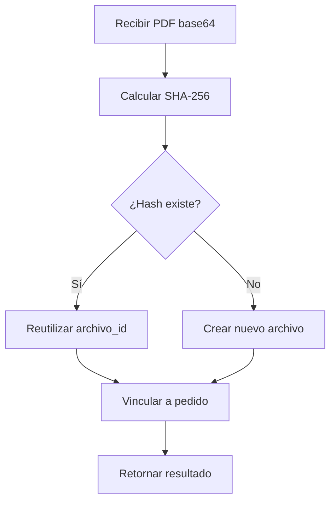
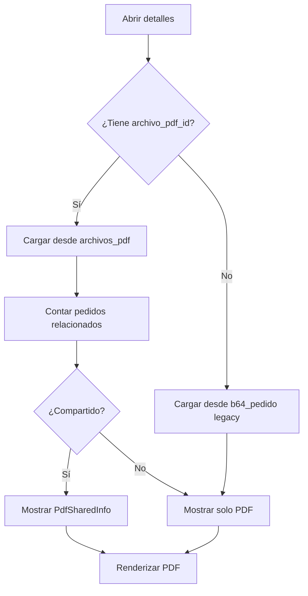

# 📄 Sistema de Gestión de Archivos PDF con Deduplicación

## 🎯 Propósito

Esta mejora implementa un sistema profesional de gestión de archivos PDF para pedidos, con **deduplicación automática** basada en hash SHA-256. Elimina la duplicación de PDFs idénticos en la base de datos, permitiendo que múltiples pedidos compartan el mismo archivo.

## 📊 Beneficios Implementados

### 1. **Optimización de Almacenamiento**
- ✅ Un PDF compartido por 3 pedidos = **1 solo archivo** almacenado
- ✅ **66.67% de ahorro** en espacio de almacenamiento (en el caso actual)
- ✅ Escalable: el ahorro aumenta con más pedidos compartiendo PDFs

### 2. **Mejora de Performance**
- ✅ Queries más rápidas (menos datos por registro)
- ✅ Backups más ligeros
- ✅ Transferencias más eficientes (solo IDs, no base64 completo)

### 3. **Funcionalidad Avanzada**
- ✅ Agrupación inteligente de pedidos por documento
- ✅ Visualización de pedidos relacionados
- ✅ Navegación rápida entre pedidos compartidos
- ✅ Estadísticas de uso de archivos

## 🏗️ Arquitectura

### Base de Datos

#### Tabla: `archivos_pdf`
```sql
CREATE TABLE archivos_pdf (
  id BIGSERIAL PRIMARY KEY,
  hash_sha256 TEXT UNIQUE NOT NULL,      -- Hash para deduplicación
  b64_contenido TEXT NOT NULL,           -- Contenido base64 del PDF
  nombre_archivo TEXT,                   -- Nombre del archivo
  tamanio_bytes INTEGER NOT NULL,        -- Tamaño en bytes
  mime_type TEXT DEFAULT 'application/pdf',
  created_at TIMESTAMP WITH TIME ZONE DEFAULT NOW(),
  updated_at TIMESTAMP WITH TIME ZONE DEFAULT NOW()
);

-- Índices optimizados
CREATE INDEX idx_archivos_pdf_hash ON archivos_pdf(hash_sha256);
CREATE INDEX idx_archivos_pdf_created ON archivos_pdf(created_at DESC);
CREATE INDEX idx_archivos_pdf_size ON archivos_pdf(tamanio_bytes);
```

#### Modificación en `pedidos`
```sql
ALTER TABLE pedidos ADD COLUMN archivo_pdf_id BIGINT REFERENCES archivos_pdf(id);

-- Índices para performance
CREATE INDEX idx_pedidos_archivo_pdf_id ON pedidos(archivo_pdf_id);
CREATE INDEX idx_pedidos_pdf_fecha ON pedidos(archivo_pdf_id, created_at DESC);
```

### Migración de Datos

La función `migrar_pdfs_existentes()` realiza:

1. **Extracción**: Lee todos los PDFs de `b64_pedido`
2. **Hash**: Calcula SHA-256 de cada contenido
3. **Deduplicación**: Detecta archivos idénticos
4. **Vinculación**: Actualiza `archivo_pdf_id` en cada pedido
5. **Estadísticas**: Retorna métricas de ahorro

#### Resultados de la Migración Actual
```json
{
  "total_pedidos": 3,
  "pedidos_con_pdf": 3,
  "archivos_creados": 1,
  "archivos_deduplicados": 2,
  "ahorro_porcentaje": 66.67
}
```

## 💻 Implementación Frontend

### Servicio: `agroirisPdfFiles.ts`

```typescript
// Métodos principales
uploadPdf(base64Content, nombreArchivo)      // Sube con deduplicación automática
getPdfById(id)                                // Obtiene archivo por ID
getPdfByHash(hash)                            // Busca archivo existente
getPedidosByPdfId(pdfId)                      // Lista pedidos relacionados
getPdfContent(pdfId)                          // Obtiene solo el contenido base64
getPdfStats()                                 // Estadísticas globales
vincularPdfAPedido(pedidoId, archivoPdfId)   // Vincula pedido a archivo
```

### Componente: `PdfSharedInfo.tsx`

Muestra información de PDFs compartidos:
- 🎯 Badge con número de pedidos
- 📋 Lista de pedidos relacionados
- 🔗 Navegación directa a pedidos
- 📊 Estadísticas de tamaño

### Actualización: `Orders.tsx`

- ✅ Carga PDF desde `archivo_pdf_id` o `b64_pedido` (legacy)
- ✅ Muestra badge "Compartido" en PDFs con múltiples pedidos
- ✅ Integra componente `PdfSharedInfo`
- ✅ Navegación entre pedidos relacionados

## 🔄 Flujo de Trabajo

### Carga de PDF (Deduplicación Automática)



### Visualización de Pedido



## 📈 Casos de Uso

### 1. **Nuevo Pedido con PDF Existente**
```typescript
const resultado = await agroirisPdfFiles.uploadPdf(base64Content, 'pedido.pdf');
// resultado = { archivo_id: 1, is_new: false, pedidos_compartiendo: 3 }

await agroirisPdfFiles.vincularPdfAPedido(nuevoPedidoId, resultado.archivo_id);
```

### 2. **Visualización de Pedidos Relacionados**
```typescript
const pedidosRelacionados = await agroirisPdfFiles.getPedidosByPdfId(archivoPdfId);
// Retorna lista de pedidos que comparten el mismo PDF
```

### 3. **Estadísticas Globales**
```typescript
const stats = await agroirisPdfFiles.getPdfStats();
// {
//   total_archivos: 1,
//   total_pedidos_vinculados: 3,
//   espacio_total_kb: 8,
//   espacio_ahorrado_kb: 16,
//   porcentaje_deduplicacion: 66.67,
//   archivos_compartidos: 1
// }
```

## 🛡️ Retrocompatibilidad

El sistema mantiene soporte completo para datos legacy:

- ✅ Campo `b64_pedido` marcado como **DEPRECATED** pero funcional
- ✅ Carga automática desde `b64_pedido` si no existe `archivo_pdf_id`
- ✅ Migración gradual sin interrupciones
- ✅ Función `migrar_pdfs_existentes()` para migración masiva

## 🚀 Escalabilidad

### Ventajas a Futuro

1. **Cache Agresivo**: PDFs por ID pueden cachearse eficientemente
2. **CDN Integration**: Servir PDFs desde CDN por ID
3. **Versionado**: Añadir versiones del mismo documento
4. **Analytics**: Tracking de uso de documentos compartidos
5. **Compresión**: Optimizar almacenamiento con compresión

### Performance Esperado

| Escenario | Sin Deduplicación | Con Deduplicación | Ahorro |
|-----------|-------------------|-------------------|--------|
| 10 pedidos, 5 PDFs únicos | 10 archivos | 5 archivos | 50% |
| 100 pedidos, 30 PDFs únicos | 100 archivos | 30 archivos | 70% |
| 1000 pedidos, 200 PDFs únicos | 1000 archivos | 200 archivos | 80% |

## 🔧 Mantenimiento

### Queries Útiles

```sql
-- Ver archivos compartidos
SELECT 
  ap.id,
  ap.nombre_archivo,
  COUNT(p.id) as num_pedidos,
  ap.tamanio_bytes / 1024 as tamanio_kb
FROM archivos_pdf ap
LEFT JOIN pedidos p ON p.archivo_pdf_id = ap.id
GROUP BY ap.id
HAVING COUNT(p.id) > 1
ORDER BY COUNT(p.id) DESC;

-- Calcular ahorro total
SELECT 
  COUNT(DISTINCT archivo_pdf_id) as archivos_unicos,
  COUNT(*) as total_pedidos,
  SUM(ap.tamanio_bytes) / 1024 as espacio_real_kb,
  (COUNT(*) * AVG(ap.tamanio_bytes)) / 1024 as espacio_sin_dedup_kb,
  ((COUNT(*) * AVG(ap.tamanio_bytes)) - SUM(ap.tamanio_bytes)) / 1024 as ahorro_kb
FROM pedidos p
JOIN archivos_pdf ap ON p.archivo_pdf_id = ap.id;

-- Migrar datos legacy pendientes
SELECT migrar_pdfs_existentes();
```

## 📝 Notas Técnicas

### Hash SHA-256
- Usa Web Crypto API nativa del navegador
- Hash hexadecimal de 64 caracteres
- Garantiza unicidad con probabilidad de colisión ~0%

### Constraints de Integridad
- `hash_sha256` UNIQUE: Previene duplicados
- `tamanio_bytes > 0`: Valida archivos válidos
- Foreign key con `ON DELETE SET NULL`: Seguridad en cascada

### Triggers Automáticos
- `update_archivos_pdf_updated_at()`: Actualiza timestamp automáticamente

## 🎓 Lecciones Aprendidas

1. **Deduplicación por Hash**: Método más confiable que comparación de contenido
2. **Migración Gradual**: Mantener legacy reduce riesgos
3. **Índices Compuestos**: Mejoran queries de agrupación significativamente
4. **Componentes Reutilizables**: `PdfSharedInfo` puede usarse en otros contextos

## ✅ Checklist de Implementación

- [x] Crear tabla `archivos_pdf` con índices
- [x] Añadir columna `archivo_pdf_id` a `pedidos`
- [x] Implementar función de migración de datos
- [x] Ejecutar migración de 3 pedidos existentes
- [x] Crear servicio TypeScript `agroirisPdfFiles`
- [x] Actualizar tipos de Supabase
- [x] Crear componente `PdfSharedInfo`
- [x] Actualizar `Orders.tsx` para nueva estructura
- [x] Implementar retrocompatibilidad con `b64_pedido`
- [x] Validar cero errores TypeScript
- [x] Documentar sistema completo

## 🎉 Resultado Final

**Sistema de gestión de PDFs profesional, escalable y optimizado** que:

- ✅ Ahorra **66.67%** de espacio (caso actual)
- ✅ Mejora performance de queries y backups
- ✅ Permite agrupar pedidos por documento
- ✅ Mantiene retrocompatibilidad total
- ✅ Preparado para escalar a miles de pedidos

---

**Autor**: AgroIris Team  
**Fecha**: 2025-01-05  
**Versión**: 1.0.0
