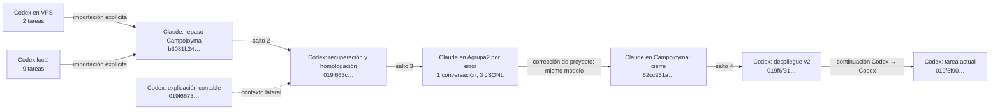

# Trazabilidad de conversaciones: Facturas Recibidas v2

Fecha de reconstrucción: 17 de julio de 2026.

Este documento reconstruye el recorrido de la homologación de Facturas Recibidas entre Codex, Claude, el repositorio, Supabase, n8n y la API de pruebas de Netagro. No reproduce secretos ni convierte afirmaciones históricas en verificaciones actuales: distingue el rastro confirmado de los estados que una conversación declaró haber dejado.

## Resultado del recuento

| Medida | Resultado | Cómo se interpreta |
|---|---:|---|
| Registros físicos relevantes localizados | **20** | 15 tareas/IDs de Codex y 5 archivos JSONL de Claude. |
| Conversaciones operativas | **18** | Las 15 tareas visibles de Codex más 3 conversaciones técnicas de Claude; los tres JSONL de Agrupa2 se consideran una sola conversación con forks. |
| Raíces independientes deduplicadas | **16** | Se colapsan los dos forks Codex: «Trae factura ejemplo de API» (7/8 jul) y las dos sesiones del VPS (29/30 jun), que comparten un tronco extenso antes de bifurcar. |
| Saltos reales Codex ↔ Claude | **4** | Dos Codex → Claude y dos Claude → Codex. |
| Bloques del recorrido principal | **7** | Corpus Codex, repaso Claude, recuperación Codex, implementación Claude, cierre Claude, despliegue Codex y tarea actual. |

La respuesta corta a «¿cuántas conversaciones acabamos teniendo?» es, por tanto: **18 conversaciones operativas, conservadas en 20 registros físicos; 16 raíces si se deduplican también los dos forks de Codex**.

## Cadena principal



El primer cambio de modelo del gráfico es la entrada desde el corpus Codex a Claude. Aunque Claude importó las nueve sesiones locales y las dos del VPS en dos actos distintos, sigue siendo un solo cambio Codex → Claude.

## Inventario cronológico

### Corpus Codex anterior a los intercambios con Claude

| # | Fecha | Superficie e identificador | Papel en el flujo |
|---:|---|---|---|
| 1 | 29 jun | Codex VPS `019f13e4-87f9-7032-a4b1-e0b3e6363119` | Acceso al servidor intermedio, copia de pruebas, creación/evolución de FastAPI y documentación. Comparte un tronco de 20 mensajes de usuario con #3 y después toma la rama principal, retomada hasta el 8 de julio. |
| 2 | 30 jun | Codex local `019f17b6-3cab-7e20-be7a-2984b83943c3` | Inicio de Campojoyma, inspección de Supabase e importación del frontend/módulo inicial de facturas. Relacionada con `25a1394`. |
| 3 | 30 jun | Codex VPS `019f1833-fb46-7f01-a529-a43993cc6df4` | Fork del tronco de #1; su tramo propio continúa con documentación y una comunicación para otra empresa. No es una segunda ejecución del clon/API compartido. |
| 4 | 2 jul | Codex local `019f21f1-81d2-7d00-803f-b5d14ac7e284` | Inspección de contenido y contexto del repositorio. Es contexto auxiliar, no una implementación propia. |
| 5 | 3 jul | Codex local `019f26ec-cb99-7812-b135-e77b7c219852` | Localización y auditoría de cambios previos del frontend. |
| 6 | 3 jul | Codex local `019f26ee-2c28-7012-bf0b-511576870033` | Evolución grande de Facturas Recibidas, muestras de staging, documentación y UI. Produjo `7258e50`, que tras rebase quedó como `7d3b7d1`; es un solo cambio. |
| 7 | 6 jul | Codex local `019f36e4-8897-7480-bb15-2257440418ba` | Revisión visual, consolidación documental, UI/servicios, extracción y nomenclatura Netagro → ERP. Relacionada con `2009620`. |
| 8 | 7 jul | Codex local `019f3b6f-2823-7d12-b55e-7bf24b0a0cda` | Semántica y presentación de «Enviado al ERP»/«Enviado». |
| 9 | 7 jul | Codex local `019f3d82-3c52-7473-bd8e-875c4803eb1f` | Factura real de ejemplo, matching API/Supabase, Edge Functions y workflow n8n. |
| 10 | 8 jul | Codex local `019f410d-52ec-7fe0-92dd-88cc83a6bae1` | Despliegue local de Vite. |
| 11 | 8 jul | Codex local `019f4215-b7a0-70b1-b17e-6247820e48ec` | Fork de la tarea #9: comparte el historial y diverge al final para explicar CTB; no es una raíz nueva. |

Los archivos de estas once tareas están bajo `docs/codex-sessions/` y `docs/codex-sessions-servidor/`. Las carpetas están excluidas de Git porque pueden contener credenciales. No deben publicarse sin ejecutar y revisar `scripts/redact-local-session-secrets.mjs`.

### Intercambios Codex / Claude y cierre v2

| # | Fecha | Superficie e identificador | Papel en el flujo |
|---:|---|---|---|
| 12 | 13–14 jul | Claude Campojoyma `b3081b24-2318-4377-bad6-3af2fb7d70b0` | El usuario pidió importar `.codex`. Claude incorporó 9 sesiones locales y después 2 sesiones del VPS, desplegó el frontend local y repasó API, estructura de facturas, n8n y Supabase. |
| 13 | 15–16 jul | Codex `019f663c-111f-7173-8591-a3855df61c48` — «Recupera conversación de Claude» | Importó explícitamente #12. Revisó endpoints y documentación, factura ONDUSPAN, frontend, Supabase y el plan completo `PDF/OCR → ERP → asiento/readback`. La ejecución extensa quedó como punto de reanudación. |
| 14 | 15 jul | Codex `019f6673-5c23-78f0-9881-011dbd46fe65` — «Explica asiento contable» | Rama lateral para entender ID técnico, número visible, Debe/Haber y bloqueo contable. Su contexto fue reinyectado en #13. |
| 15 | 17 jul | Claude bajo Agrupa2 por error — `f6be5c47-e5a8-4bb7-b834-e11f1f8705d3`, fork `c344c7ef-c287-4b9b-b565-5535e2aa0482`, continuación `3ef753c5-e203-4d8e-a7a7-5acfbd42d715` | El usuario pidió localizar en Codex la conversación #13 y terminarla. Los tres archivos comparten cientos de UUID y forman una sola conversación técnica (`local_92e7b8cb-8a67-4008-8599-29cee34082a6` en el gestor de sesiones). Implementó la homologación v2 y creó `ba7cef8` en el repo correcto, aunque la sesión estaba clasificada en el proyecto equivocado. |
| 16 | 17 jul | Claude Campojoyma `62cc951a-e7ad-4fa1-9b27-9e4db6516c14` | Recuperó #15 mediante el gestor de sesiones, verificó typecheck/tests/build, hizo push de la rama y renombró la sesión huérfana. No hizo merge ni despliegue coordinado. |
| 17 | 17 jul | Codex `019f6f31-e989-7c03-98dc-54bfaf3671fa` — «Retomar homologación facturas v2» | Importó explícitamente #16. Aplicó la fase aditiva de Supabase, desplegó 6 Edge Functions, endureció/activó extracción n8n, promovió API y código, creó `a3752a6` y llevó `origin/main` a ese commit. Dejó frontend público y lockdown pendientes; mantuvo cerrada la escritura contable. |
| 18 | 17 jul | Codex `019f6f90-1f51-7823-8551-63d4eb8908bb` — tarea actual | Recibió el resumen de #17, aclaró la separación frontend/Supabase/API, arrancó el frontend local, identificó la confusión entre hosts SSH, reconstruyó esta trazabilidad y auditó/endureció localmente el nuevo repositorio `api-campojoyma` sin desplegarlo. |

## Libro de traspasos

| Momento | Origen → destino | Tipo | Evidencia explícita |
|---|---|---|---|
| 13 jul | Corpus Codex → Claude `b3081b24…` | **Salto 1: Codex → Claude** | «accedas a la carpeta `.codex`… y las importes aquí»; después se importaron también las sesiones del VPS. |
| 15 jul | Claude `b3081b24…` → Codex `019f663c…` | **Salto 2: Claude → Codex** | «tráete del Claude la conversación en local… la última en la que hablamos de la API». |
| 17 jul | Codex `019f663c…` → Claude Agrupa2 | **Salto 3: Codex → Claude** | «busco en Codex esta conversación “Recupera conversación de Claude”… retómala y termina el trabajo». |
| 17 jul | Claude Agrupa2 → Claude `62cc951a…` | Mismo modelo; corrección de proyecto | «sigue con esa conversación… te creé la conversación en el proyecto que no era». |
| 17 jul | Claude `62cc951a…` → Codex `019f6f31…` | **Salto 4: Claude → Codex** | «Retoma esa conversación de Claude, del Claude local». |
| 17 jul | Codex `019f6f31…` → Codex `019f6f90…` | Mismo modelo; tarea nueva | Se pegó el resumen final de despliegue como punto de partida de la tarea actual. |

Secuencia de modelos, sin contar forks internos:

```text
Codex → Claude → Codex → Claude → Claude → Codex → Codex
          1        2        3                  4
```

## Correlación con Git

| Commit | Fecha | Qué consolida | Atribución verificable |
|---|---|---|---|
| `25a1394` | 30 jun | Frontend inicial, módulo Facturas Recibidas, servicios/tipos, Edge Functions y primeras migraciones. | Sesión Codex `019f17b6…`. |
| `7d3b7d1` | 3 jul | Evolución grande de UI, servicios, documentación y lectura Edge. | Sesión Codex `019f26ee…`; `7258e50` fue el hash anterior al rebase, no otro cambio. |
| `2009620` | 6 jul | Consolidación de documentación, UI/servicios, extracción y contrato ERP. | Sesión Codex `019f36e4…`. |
| `ba7cef8` | 17 jul 10:21 | Homologación v2 completa en código, contrato, frontend, migraciones, Edge, docs, OpenAPI, parche API y workflows. | Contiene `Co-Authored-By: Claude Fable 5` y dice «Continuación de la sesión interrumpida». |
| `a3752a6` | 17 jul 11:56 | Endurecimiento de autenticación de ingestión, fallback por hash, tests y ajuste n8n. | Creado durante el cierre posterior; actualmente es `origin/main`. |

No se deben sumar como cambios de producto independientes `7258e50`, `ea6f211` ni `1e39238`: el primero fue reescrito por rebase y los dos últimos son un checkpoint WIP de seguridad. `079eb86` es una corrección de modo oscuro y `aecaa83` un despliegue VPS periférico.

## Decisiones que sobrevivieron a toda la cadena

1. Existen tres sistemas distintos y no deben mezclarse:
   - frontend React/Vite de este repositorio;
   - backend y persistencia de trabajo en Supabase CAMPOJOYMA (`adbprpemmbspntbttziz`);
   - integración en dos saltos: el VPS `82.25.119.150` aloja n8n, documentación y el túnel `:18000`; la FastAPI y la copia MariaDB de pruebas están históricamente en `karma-box` (`88.30.71.235:2222`, API `:8000`).
2. La estructura de la base Netagro de pruebas es inmutable para este trabajo. La integración consume la API; no autoriza cambios de esquema ni recrear la contabilidad mediante `INSERT` manual.
3. La API puede evolucionar en su código/contrato sin alterar la estructura de la base de pruebas.
4. `FRR_IdAsientoNet` es un ID técnico, no el número visible del asiento.
5. CTB, desglose de gastos y asiento Debe/Haber son conceptos distintos y no se deben fabricar filas cuando la API devuelve vacío.
6. Los albaranes de material usan origen `MA`/`albmaterial`; deben conservar `source_table`, `source_id` e importe sin inventar reparto parcial.
7. Una factura con identidad ERP queda en solo lectura; una respuesta incierta se reconcilia, no se reintenta a ciegas.
8. Producción no se debe tocar para probar la escritura contable. La escritura sigue cerrada hasta disponer del endpoint y readback oficial de Netagro.
9. El lockdown de Supabase solo debe aplicarse después de desplegar y verificar un frontend compatible.
10. El estado de idempotencia vive fuera de Netagro y se provisiona durante el
    despliegue. FastAPI no crea estructuras al arrancar ni durante una petición;
    sin almacén válido debe fallar cerrado.
11. Los usuarios MariaDB runtime se validan mediante `SHOW GRANTS`, sin ejecutar
    DDL para probarlos. La cuenta lectora solo necesita `USAGE`/`SELECT`.

## Estado al cerrar esta reconstrucción

Esta tabla refleja el último estado declarado por la tarea Codex `019f6f31…`, contrastado con Git cuando es posible. No sustituye un nuevo smoke test de los servicios externos.

| Parte | Estado trazado | Calidad de la evidencia |
|---|---|---|
| Código v2 | `origin/main` y la rama de homologación apuntan a `a3752a6`. | Confirmado por Git local/remoto configurado. |
| Frontend local | La instancia levantada en la tarea actual responde en `http://127.0.0.1:8081`. Existe además otra instancia Vite previa en `8080`; no se atribuye a esta tarea. | Ambos puertos respondieron HTTP 200 durante la auditoría del 17 jul. |
| Frontend público | El dominio sigue sirviendo `index-CJ7GZs7L.js`; el build local v2 genera `index-CRMunZTp.js`. | Verificado de nuevo el 17 jul. El DNS del dominio apunta a `217.154.101.108`. |
| Supabase | Migración aditiva v2 y fallback de autenticación aplicados; lockdown ausente. Las 6 funciones principales v2 están `ACTIVE` y existen además 2 funciones auxiliares anteriores. | Verificado de nuevo en CAMPOJOYMA mediante consultas de solo lectura el 17 jul. |
| n8n | Extracción endurecida y activa; workflow de escritura contable cerrado. | Declarado y probado sin PDF en `019f6f31…`. |
| API de pruebas | Sana por el túnel del VPS: OpenAPI `0.1.0`, 40 paths y 41 operaciones; MariaDB reporta host `karma-box`. | Verificado de nuevo por SSH de solo lectura a `root@82.25.119.150` el 17 jul. El VPS no es el host físico de la FastAPI/BBDD. |
| Repositorio API local | `KarmaAgenciaGit/api-campojoyma`, `main` en `ab21689` y un commit por delante de remoto. El working tree endurece SQLite, readback y grants y pasa 33 tests, pero está sin commit/push. | Verificado localmente; no equivale a despliegue en `:8001` o `:8000`. |
| Escritura contable | Desactivada por ausencia de endpoint/readback oficial de Netagro. | Bloqueo explícito y repetido en conversación, documentación y commit `ba7cef8`. |

La dirección `217.154.101.108` está confirmada por DNS como host público del frontend y rechazó la clave disponible. No debe confundirse con el VPS de integración `82.25.119.150`, ni este último con `karma-box`, donde viven la FastAPI y MariaDB de pruebas detrás del túnel.

## Artefactos que concentran el conocimiento técnico

- `docs/DOCUMENTACION_FACTURAS_CAMPOJOYMA_CONSOLIDADA.md`: modelo y documentación funcional consolidada.
- `docs/FACTURAS_RECIBIDAS_API_CONTRACT.md`: contrato canónico v2.
- `docs/FACTURAS_RECIBIDAS_API_V2_STAGING.md`: estado y runbook de staging en el momento de la intervención del 16 de julio.
- `docs/openapi/netagro-test-api-v0.2.0.json`: OpenAPI capturada.
- `docs/patches/fastapi-netagro-v0.2.0.patch`: parche reproducible de FastAPI.
- Working tree local de `KarmaAgenciaGit/api-campojoyma`: fuente prevista separada
  de la API hasta que el endurecimiento se revise y publique; el parche de este
  repositorio queda como copia sincronizada del diff runtime.
- `docs/n8n/campojoyma-factura-recibida-extraccion-segura-v2.json`: extracción n8n saneada y reproducible mediante `scripts/generate_safe_factura_workflow.mjs`.
- `docs/n8n/campojoyma-factura-recibida-extraccion-final.json`: artefacto legacy usado solo como plantilla estructural por el generador; no importar ni activar porque contiene decisiones contables anteriores al saneamiento v2.
- `docs/n8n/campojoyma-facturas-recibidas-write-v2.disabled.json`: escritura v2 deliberadamente desactivada.
- `scripts/verify-facturas-recibidas-api.mjs`: verificación del contrato API.
- `scripts/verify-supabase-target.mjs`: guardarraíl para comprobar el proyecto Supabase correcto.

## Protocolo para que el historial no vuelva a fragmentarse

Al cerrar cada tarea que cambie estado, añadir al final de este documento un registro con:

```text
Fecha y hora:
Herramienta y task/session ID:
Repositorio, rama y commit:
Qué se comprobó antes de actuar:
Cambios locales:
Cambios externos realmente aplicados:
Pruebas y resultados:
Estado de frontend / Supabase / n8n / API / ERP:
Bloqueos confirmados:
Siguiente acción exacta:
```

Una tarea nueva debe empezar leyendo este documento y el runbook, no importando de nuevo todas las transcripciones. Los historiales originales quedan como evidencia secundaria; Git, los artefactos y las verificaciones actuales mandan sobre cualquier resumen antiguo.
