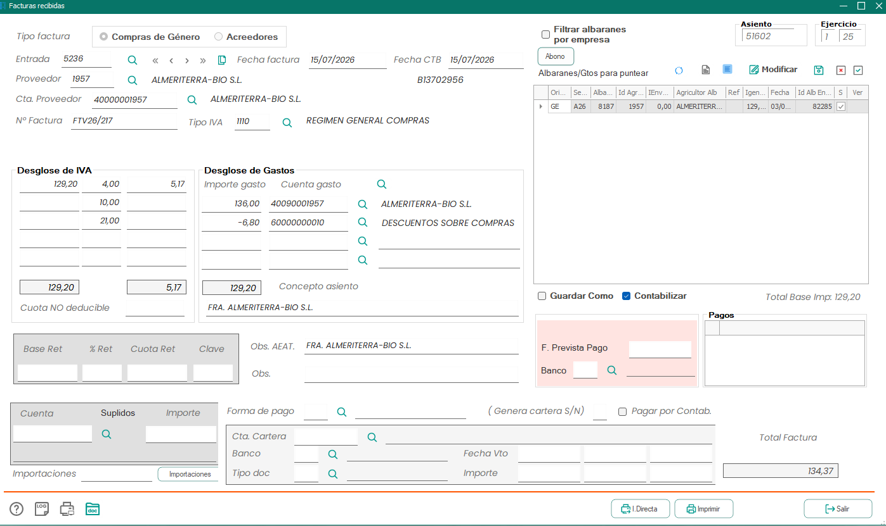
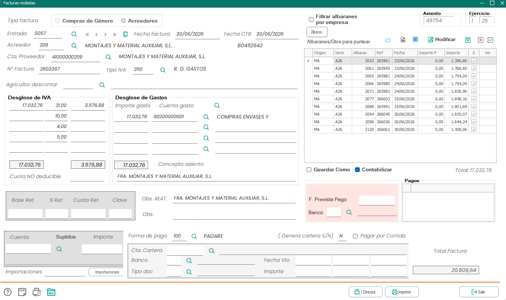
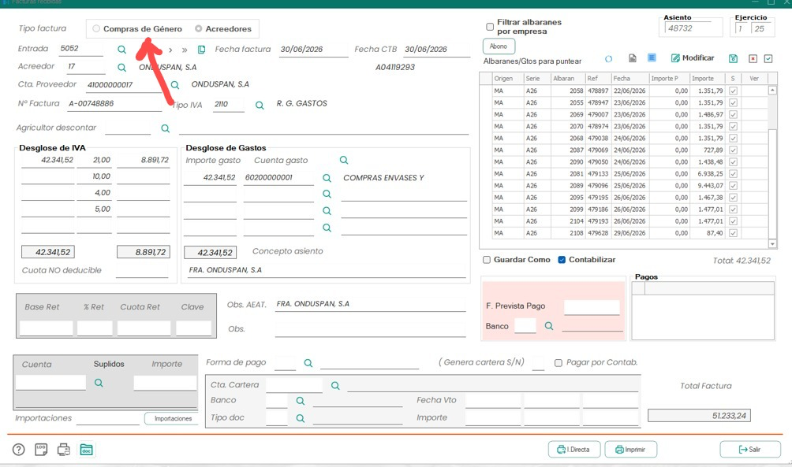

# Correo de actualización funcional del 28/07/2026

Esta carpeta conserva las capturas funcionales incluidas en el correo
`Fwd: RE: Actualización de estado del proyecto`, recibido el 28 de julio de
2026. El mensaje se incorporó como evidencia para precisar la pantalla de
facturas recibidas de Netagro.

El `.eml` original no se copia al repositorio porque incluye direcciones,
teléfonos, firmas y avisos legales que no forman parte del análisis funcional.
Su SHA-256, para poder identificar el original, es:

```text
DA838FADE7D7DDAC61F37AFC804A3883F097F037B5F2B37B933801991DA9378C
```

El segundo correo del mismo hilo, dedicado expresamente a los albaranes de
entrada para compras de género, tampoco se copia por el mismo motivo. Su
SHA-256 es:

```text
145E455BB56CE09F5E67A2FA89AC87DA430479EBAA3562D3C9E0C23F959E3ED3
```

## Cronología saneada

- **14/07/2026:** se comunicó que estaban en marcha las últimas pruebas contra
  la base de datos de ensayo y que se avisaría antes de probar en producción.
- **24/07/2026:** se pidió un vídeo corto de un caso completo para aclarar
  campos y claves del ERP.
- **28/07/2026:** se solicitaron capturas de `Compras de Género` y
  `Acreedores`, además del proceso de inserción de un albarán vacío y completo.
- **Respuesta de Campojoyma:** «La casilla agricultores descontar no se
  utiliza», acompañada de cuatro capturas de `Facturas recibidas`.

## Confirmación funcional

La única regla expresada de forma inequívoca en el texto de la respuesta es:

> La casilla agricultores descontar no se utiliza.

Consecuencias:

- el frontend no debe solicitar ni mostrar ese dato;
- el campo físico `FRR_IdAgricultorDto` se conserva en los contratos y modelos
  por compatibilidad con Netagro;
- no debe deducirse ni rellenarse a partir de otro dato de la factura.

Esta confirmación coincide con la medición histórica disponible:
`FRR_IdAgricultorDto = 0` en 285 de 285 cabeceras inspeccionadas.

## Observaciones de las capturas

Las imágenes permiten afirmar qué se muestra visualmente, pero no demuestran por
sí solas cómo persiste cada selector ni qué procedimiento interno ejecuta
Netagro:

- `Compras de Género` y `Acreedores` son opciones excluyentes del bloque
  `Tipo factura`.
- En la vista de compras de género aparece `Proveedor`; en la de acreedores,
  `Acreedor`.
- `Agricultor descontar` aparece en la pantalla de acreedores, aunque el cliente
  confirma que no se utiliza.
- La tabla `Albaranes/Gtos para puntear` cambia de columnas y contenido entre
  ambos ejemplos.
- Las cuatro primeras capturas pertenecen a `Facturas recibidas`. El segundo
  correo sí documenta de forma separada el alta y detalle de un albarán de
  entrada para compras de género.

No se usa la columna `Origen` de los punteos para inferir el tipo de la factura:
en el ejemplo de acreedores las filas visibles tienen origen `MA`.

## Capturas recibidas

### 1. Compras de Género, formulario vacío

Muestra el selector `Compras de Género`, los campos del proveedor y la tabla de
punteos sin datos.


```text
SHA-256: D0F83B546A2C40F2FF07B6876D471FA81DFB88CF1AD8C6C7E023821BCB04900A
```

### 2. Acreedores, formulario vacío

Muestra el selector `Acreedores`, el campo `Agricultor descontar` y la variante
de la tabla de punteos.


```text
SHA-256: D6BB0ED27EDC2AD727440478891B72562D4EDFF9026F43229B44F0C278915B1F
```

### 3. Compras de Género, ejemplo completo

Ejemplo de `ALMERITERRA-BIO S.L.` con una fila de punteo de origen `GE`, base
`129,20`, IVA del `4 %` y total de factura `134,37`.



```text
SHA-256: FA1111AC94C44742A2EBE28BAC1101092D410EFDB569C7ED6B7F1F67FB96D3BC
```

### 4. Acreedores, ejemplo completo

Ejemplo de `MONTAJES Y MATERIAL AUXILIAR, S.L.` con diez punteos visibles de
origen `MA`, base `17.032,76`, IVA del `21 %`, cuenta de gasto `60200000001` y
total de factura `20.609,64`.



```text
SHA-256: D9F14ED4F14512A442814758E6CF7AC40CAD7811FDD38ADE0218B21884ADC2AD
```

### 5. Captura incluida en nuestra consulta

La captura anotada de Onduspan acompañaba la pregunta enviada sobre el selector
de tipo. Se conserva para relacionar la respuesta con el punto concreto que se
estaba consultando; no constituye una nueva factura de muestra.



```text
SHA-256: A533C41DB9A0F8C113F04E7F24F7825ECA03A2D667CABA4FCD69EFC7B853DCE9
```

### 6. Albarán de entrada, formulario vacío

Confirma que el albarán de compras de género es un documento independiente de
la factura. La cabecera utiliza campaña, serie y número; el ERP denomina
`Proveedor` al tercero, aunque el campo físico corresponde al agricultor.


```text
SHA-256: D10C4CFFBDD2B414DD12EB55B10AA1313F3F24FB154C8ADF5F3F8861E94EA5D1
```

### 7. Albarán de entrada, ejemplo cumplimentado

Ejemplo `25 / A26 / 8436`, de fecha `27/07/2026`, asociado al agricultor
`1954 - BENITO DIAZ DIAZ`. La rejilla contiene partida, género, categoría,
tipo de cultivo/calidad, envase, bultos, kilos, precio e importe. En este caso
hay `88` bultos y `21.194` kg netos, pero precio e importe cero: la recepción
logística puede existir antes de su valoración contable.


```text
SHA-256: F29ACF042BB983F6D725613922F68552CCCC8F1F786425717EAB20DA345E572C
```

## Consecuencias para la integración de albaranes GE

- La cabecera vigente está en `albentrada`; la identidad de negocio es
  `AEN_campa + AEN_serie + AEN_albaran`.
- El `Proveedor` visual se resuelve contra `agricultores` mediante
  `AEN_idagricultor`, no contra `acreedores`.
- Las líneas son detalle del albarán y deben consultarse bajo demanda desde la
  API. Supabase conserva la referencia, no una copia permanente de todas ellas.
- En facturas GE ya vinculadas, el histórico se lee desde `albentrada_his`
  mediante `AEH_idfacturafirme`, manteniendo `AEH_idalbaran` como enlace a la
  cabecera.
- Ese histórico se expone inicialmente solo para lectura. No forma parte del
  catálogo de punteos seleccionables ni de las mutaciones de la API.
- `FRR_tipofactura` y el `Origen` del albarán siguen siendo ejes distintos; no
  se debe inferir uno a partir del otro.

## Material excluido

Los correos contenían además imágenes de logotipos o firmas y una repetición de
la captura de factura incluida en el hilo. No se han copiado porque no aportan
información funcional nueva.
