# Reunión ERP de facturas y albaranes — 30/07/2026

Uso interno. Este dossier conserva juntas la pantalla compartida y la
transcripción de la reunión para que las conclusiones funcionales puedan
revisarse sin depender de la memoria de la conversación.

## Fuente, alcance y límites

- Fuente: grabación de Microsoft Teams `Reunión facturas y Albaranes -
  CampoJoyma`, jueves 30/07/2026, 12:00–12:30.
- Duración de la grabación: `24:20`.
- Tramo funcional revisado: aproximadamente `05:58–23:45`. El comienzo contiene
  principalmente conexión, carga y preparación de la pantalla.
- Método: primer recorrido completo de la grabación a velocidad x2 y segunda
  pasada con el vídeo pausado a pantalla completa, revisando los fotogramas
  cercanos para conservar la versión más estable de cada vista distinta.
- Resultado: nueve capturas de vistas ERP y una captura complementaria del
  documento de Onduspan usado para explicar el descuento, en tres capas:
  evidencia original con transcripción, fotograma bruto a pantalla completa y
  recorte limpio de la pantalla compartida.
- Las capturas originales conservan juntas la pantalla compartida y la
  transcripción asociada. La segunda serie conserva el fotograma completo del
  reproductor a `1920×1080`; de ella se deriva una serie limpia a `1674×881`.

La transcripción fue generada automáticamente y Teams advierte que puede ser
incorrecta. Por eso este documento sanea y parafrasea su contenido. Una captura
demuestra lo que se mostró y explicó en pantalla; por sí sola no demuestra qué
tabla, procedimiento o endpoint persiste cada dato.

## Serie revisada a pantalla completa

La serie limpia elimina únicamente las franjas del reproductor de Teams y la
columna de participantes. No se ha retocado, recompuesto ni reinterpretado el
contenido de la pantalla compartida. Las capturas originales siguen siendo la
referencia para relacionar cada vista con la transcripción.

Al revisar fotogramas adyacentes se eligieron instantes ligeramente anteriores
a algunos de la primera pasada (`11:20`, `17:08`, `19:20`, `21:25`, `22:13` y
`23:26`), porque mostraban la misma vista con mayor estabilidad o legibilidad.

| Tiempo elegido | Vista | Recorte limpio | Fotograma bruto | Teams + transcripción |
|---|---|---|---|---|
| `06:10` | Formulario vacío y tipos de factura | [Abrir](limpias-pantalla-completa/01-06m10-formulario-vacio-tipos-factura.png) | [Abrir](fotogramas-pantalla-completa/01-06m10-formulario-vacio-tipos-factura.png) | [Abrir](01-06m10-factura-recibida-tipos-compra-y-acreedor.png) |
| `07:27` | Acreedor de materiales con albarán `MA` | [Abrir](limpias-pantalla-completa/02-07m27-acreedor-materiales-con-albaran-ma.png) | [Abrir](fotogramas-pantalla-completa/02-07m27-acreedor-materiales-con-albaran-ma.png) | [Abrir](02-07m27-acreedor-materiales-con-albaran.png) |
| `08:13` | Acreedor con múltiples gastos de origen `GC` | [Abrir](limpias-pantalla-completa/03-08m13-acreedor-multiples-gastos-origen-gc.png) | [Abrir](fotogramas-pantalla-completa/03-08m13-acreedor-multiples-gastos-origen-gc.png) | [Abrir](03-08m13-acreedor-con-multiples-gastos-gc.png) |
| `11:20` | Visualizador del asiento contable | [Abrir](limpias-pantalla-completa/04-11m20-visualizador-asiento-contable.png) | [Abrir](fotogramas-pantalla-completa/04-11m20-visualizador-asiento-contable.png) | [Abrir](04-11m22-visualizador-asiento-contable.png) |
| `13:39` | Buscador de cuentas de gasto | [Abrir](limpias-pantalla-completa/05-13m39-buscador-cuentas-gasto.png) | [Abrir](fotogramas-pantalla-completa/05-13m39-buscador-cuentas-gasto.png) | [Abrir](05-13m39-buscador-cuentas-gasto.png) |
| `17:08` | Consulta de facturas de Onduspan | [Abrir](limpias-pantalla-completa/06-17m08-consulta-facturas-proveedor-onduspan.png) | [Abrir](fotogramas-pantalla-completa/06-17m08-consulta-facturas-proveedor-onduspan.png) | [Abrir](06-17m13-consulta-facturas-proveedor.png) |
| `19:20` | Soporte documental de Onduspan, no ERP | [Abrir](limpias-pantalla-completa/07-19m20-soporte-documental-factura-onduspan.png) | [Abrir](fotogramas-pantalla-completa/07-19m20-soporte-documental-factura-onduspan.png) | [Abrir](10-19m27-soporte-factura-onduspan-descuento-3pct.png) |
| `21:25` | Punteos `MA` de Onduspan y control de total | [Abrir](limpias-pantalla-completa/08-21m25-onduspan-punteos-ma-control-total.png) | [Abrir](fotogramas-pantalla-completa/08-21m25-onduspan-punteos-ma-control-total.png) | [Abrir](07-21m33-factura-onduspan-punteos-ma-y-control-total.png) |
| `22:13` | Detalle del albarán de materiales | [Abrir](limpias-pantalla-completa/09-22m13-detalle-albaran-materiales.png) | [Abrir](fotogramas-pantalla-completa/09-22m13-detalle-albaran-materiales.png) | [Abrir](08-22m17-albaran-materiales-detalle-y-descuento.png) |
| `23:26` | `Contabilizar` activado y asiento asignado | [Abrir](limpias-pantalla-completa/10-23m26-contabilizar-y-asiento.png) | [Abrir](fotogramas-pantalla-completa/10-23m26-contabilizar-y-asiento.png) | [Abrir](09-23m27-contabilizar-traspaso-gestion-contabilidad.png) |

Las dimensiones, tamaños y huellas de ambas series están en el
[manifiesto de capturas a pantalla completa](MANIFIESTO_PANTALLA_COMPLETA.md).

## Conclusión ejecutiva

El flujo manual observado en Netagro es este:

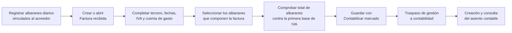

Esta reunión aclara el funcionamiento pretendido del ERP, pero **no homologa
todavía nuestra escritura por API**:

- En el uso manual del ERP, `Contabilizar` marcado hace que, al guardar, la
  factura pase de gestión a contabilidad y se cree el asiento.
- En nuestra integración de TEST se sigue forzando
  `FRR_Contabilizar=N`, porque aún no está homologado el mecanismo oficial que
  crea y devuelve un asiento verificable.
- `dry_run` no es una opción ni una fase del operador dentro de Netagro. Es el
  preflight no mutante de nuestra API antes de un posible commit.
- Por tanto, activar `Contabilizar` o retirar el `dry_run` no son atajos
  equivalentes a completar la integración.

## Confirmaciones funcionales

### 1. Dos circuitos visibles de factura

- `Compras de Género`: compras a agricultores para confeccionar/preparar el
  producto y venderlo.
- `Acreedores`: materiales, reparaciones, servicios y demás compras.

La explicación confirma el sentido funcional de ambas opciones, pero no
autoriza a deducir el circuito desde el origen de un albarán o gasto.

### 2. Cuenta de gasto: automática solo cuando es estable

Algunos acreedores tienen una cuenta grabada porque no cambia. Cuando un mismo
acreedor puede corresponder, por ejemplo, a inmovilizado o a un gasto directo
del ejercicio, la cuenta se deja deliberadamente en blanco y el operador la
elige manualmente.

La búsqueda manual comienza por el prefijo de tres dígitos y ofrece sus
subcuentas. Durante la reunión se mencionan como ejemplos `602` para
materiales, `607` para trabajos realizados por otras empresas y `631` para
tributos. Son ejemplos del Plan General Contable, no defaults universales.

### 3. Entrada, fecha CTB, régimen y asiento son conceptos distintos

- `Entrada` es un contador o número de registro de la factura en gestión; no es
  el número del documento del proveedor.
- `Asiento` es el asiento contable real y pertenece a la parte de contabilidad.
- `Fecha factura` es la emitida por el proveedor.
- `Fecha CTB` es la fecha de contabilización. Se explicó que puede diferir de la
  fecha de factura cuando el documento llega tarde.
- El régimen `2110` se describió como el más habitual para gastos. Se mencionó
  `2115` para inmovilizado, además de regímenes distintos para operaciones
  intracomunitarias o sin IVA.

La explicación de `Fecha CTB` entra en conflicto con la política técnica
actual `invoice_date`. Hasta que Campojoyma confirme el criterio exacto que
debe aplicar la automatización, no debe cambiarse silenciosamente un valor por
otro ni considerarse resuelta esta discrepancia.

### 4. Los albaranes de materiales nacen antes que la factura

Los movimientos del proveedor se introducen diariamente en la pantalla
`Albaranes de materiales` y quedan vinculados al acreedor. Cuando llega la
factura, el operador selecciona en la rejilla derecha todos los albaranes que
la componen. Desde la factura se puede abrir el detalle de un albarán, aunque
su alta se realiza en otra pantalla.

### 5. Control operativo del punteo

El total inferior de los albaranes seleccionados debe coincidir con la primera
base del `Desglose de IVA`. Si no coincide, el operador investiga un posible
error de tarifa, descuento o facturación. Esta es una condición de revisión
funcional; no basta con encontrar referencias parecidas.

### 6. Descuento especial del 3 % de Onduspan

La factura usada en la reunión aplica un descuento especial del `3 %` sobre el
total. En la operativa descrita, quien registra los materiales distribuye ese
3 % en cada línea de albarán, lo que debe conducir al mismo total. Se afirmó
que Onduspan es el único proveedor con ese descuento.

Esta variación debe modelarse como regla específica del proveedor, después de
confirmar su identidad ERP y el criterio de redondeo. No debe convertirse en
una regla general ni deducirse únicamente por el nombre visible.

### 7. `Contabilizar` es el puente entre gestión y contabilidad

Con la casilla desmarcada, guardar la factura no genera el asiento. Con la
casilla marcada, guardar realiza el traspaso de gestión a contabilidad y crea
el asiento mostrado en la parte superior. Poder abrir ese asiento es la
comprobación visual de que la factura está registrada en contabilidad.

La indicación operativa fue mantenerla siempre marcada en el trabajo manual.
Esto describe el objetivo de negocio, no una autorización para activar la
contabilización de nuestra API sin conocer y homologar el mecanismo oficial.

## Estado de las aparentes contradicciones

| Concepto | Flujo manual explicado en la reunión | Estado de nuestra integración | Decisión segura |
|---|---|---|---|
| `dry_run` | No aparece en el ERP ni forma parte del trabajo del operador. | Es un preflight de la API que valida sin escribir. | Mantenerlo como protección técnica y no presentarlo como un nuevo flujo de facturas. |
| `Contabilizar` | Marcado al guardar: traspasa a contabilidad y crea asiento. | En TEST se fuerza `FRR_Contabilizar=N`; creación oficial del asiento aún no homologada. | Separar el objetivo funcional de la capacidad técnica actual. No basta con cambiar `N` por `S`. |
| Fecha CTB | Fecha de contabilización; puede diferir si la factura llega tarde. | La regla configurada actualmente es `invoice_date`. | Marcar la regla como pendiente de revalidación y no alterar la semántica automáticamente. |
| Cuenta de gasto | Fija por acreedor solo cuando no cambia; en casos ambiguos se elige manualmente. | Existe una propuesta general `60200000001`, especializable. | Revisar el alcance de esa propuesta; conservar resolución manual cuando haya más de una naturaleza posible. |
| Origen `GC`/`CG` | Se habló de gastos comerciales o gastos de compra asumidos; la propia conversación contiene dudas y cambios de sigla. | Los orígenes ya se tratan como eje distinto del tipo de factura. | No crear un nuevo mapeo rígido hasta contrastar el diccionario oficial del ERP. |
| Descuento del 3 % | Caso específico de Onduspan, distribuido por línea de albarán. | No queda homologado como regla automática general. | Configurarlo por proveedor solo tras confirmar identidad, base y redondeo. |

## Índice cronológico de evidencias originales

Este índice mantiene los primeros fotogramas de Teams porque son los que
incluyen la transcripción. La galería siguiente usa los fotogramas más nítidos
de la segunda pasada y enlaza de vuelta a estas evidencias.

| Tiempo | Vista | Qué permite confirmar | Certeza |
|---|---|---|---|
| [06:10](01-06m10-factura-recibida-tipos-compra-y-acreedor.png) | Factura recibida, formulario | Dos circuitos visibles: Compras de Género y Acreedores. | Alta |
| [07:27](02-07m27-acreedor-materiales-con-albaran.png) | Acreedor de materiales | Una factura de materiales muestra sus albaranes/gastos candidatos en la rejilla derecha. | Alta |
| [08:13](03-08m13-acreedor-con-multiples-gastos-gc.png) | Acreedor con varias filas `GC` | Existe un origen distinto de `MA`; su expansión verbal exacta no queda suficientemente limpia. | Media |
| [11:22](04-11m22-visualizador-asiento-contable.png) | Visualizador de asiento | Entrada y asiento son identificadores distintos; el asiento contiene apuntes Debe/Haber. | Alta |
| [13:39](05-13m39-buscador-cuentas-gasto.png) | Buscador de cuentas | El operador puede buscar por prefijo y elegir una subcuenta de gasto. | Alta |
| [17:13](06-17m13-consulta-facturas-proveedor.png) | Consulta de facturas | Se puede localizar una factura filtrando por proveedor y abrir su número de Entrada. | Alta |
| [19:27](10-19m27-soporte-factura-onduspan-descuento-3pct.png) | Documento Onduspan, soporte no ERP | El 3 % se explica como particular del proveedor y distribuible por línea. | Alta para la explicación; no prueba persistencia ERP |
| [21:33](07-21m33-factura-onduspan-punteos-ma-y-control-total.png) | Onduspan con albaranes `MA` | La suma de seleccionados se contrasta con la primera base de IVA. | Alta |
| [22:17](08-22m17-albaran-materiales-detalle-y-descuento.png) | Detalle de Albaranes materiales | El albarán se registra antes, queda ligado al acreedor y puede consultarse desde la factura. | Alta |
| [23:27](09-23m27-contabilizar-traspaso-gestion-contabilidad.png) | Factura recibida, casilla Contabilizar | Guardar con la casilla marcada traspasa a contabilidad y crea el asiento. | Alta |

## Capturas limpias y lectura contextual

### 06:10 — Tipos de factura

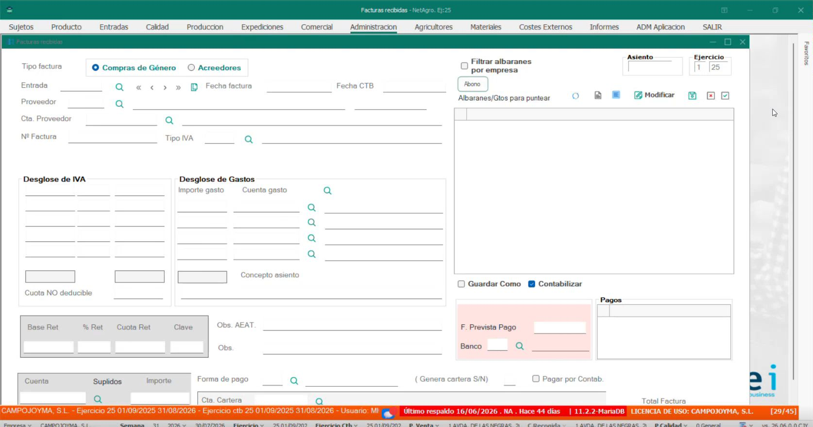

[Fotograma bruto 1920×1080](fotogramas-pantalla-completa/01-06m10-formulario-vacio-tipos-factura.png) ·
[Teams y transcripción asociada](01-06m10-factura-recibida-tipos-compra-y-acreedor.png).

La pantalla vacía permite aislar la estructura general. La conversación
distingue el circuito de compras a agricultores del resto de acreedores.

### 07:27 — Acreedor de materiales con albarán

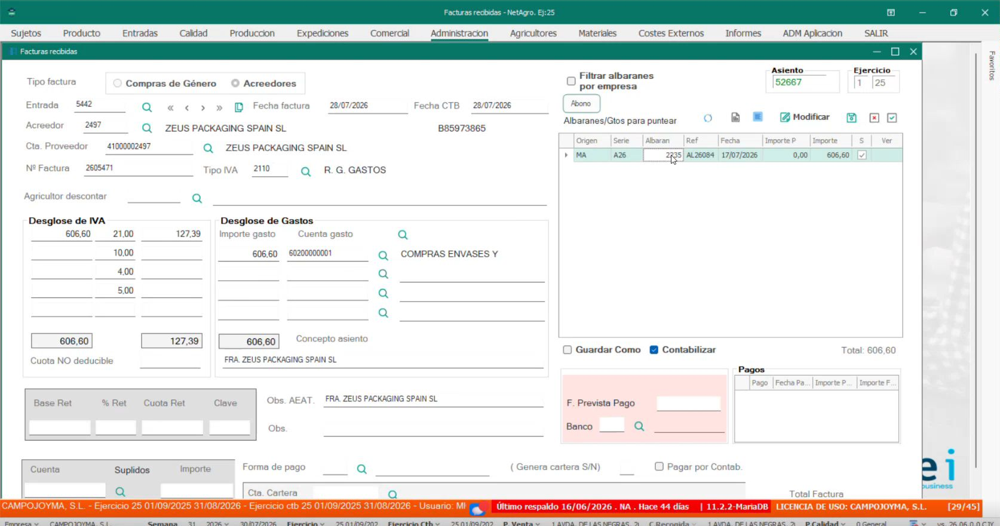

[Fotograma bruto 1920×1080](fotogramas-pantalla-completa/02-07m27-acreedor-materiales-con-albaran-ma.png) ·
[Teams y transcripción asociada](02-07m27-acreedor-materiales-con-albaran.png).

Se abre una factura de ZEUS PACKAGING y se identifica la línea de la derecha
como albarán asociado a la compra de materiales.

### 08:13 — Múltiples filas de origen `GC`

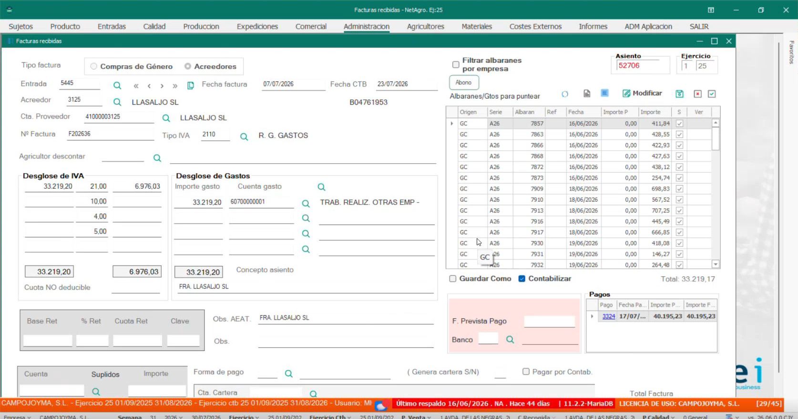

[Fotograma bruto 1920×1080](fotogramas-pantalla-completa/03-08m13-acreedor-multiples-gastos-origen-gc.png) ·
[Teams y transcripción asociada](03-08m13-acreedor-con-multiples-gastos-gc.png).

La vista demuestra que existen familias de punteo distintas de `MA`. La
transcripción alterna `GC` y `CG` y duda entre “gastos comerciales” y “gastos
de compra”; se conserva la evidencia sin fijar una traducción técnica.

### 11:20–11:22 — Visualizador de asiento

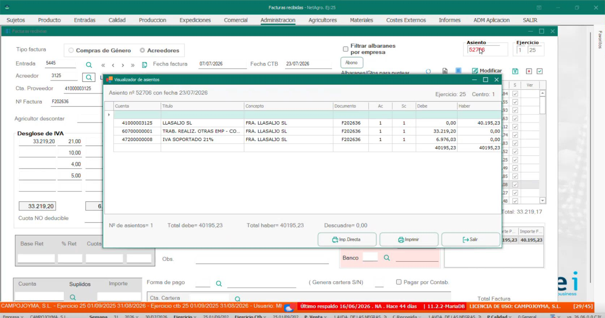

[Fotograma bruto 1920×1080](fotogramas-pantalla-completa/04-11m20-visualizador-asiento-contable.png) ·
[Teams y transcripción asociada](04-11m22-visualizador-asiento-contable.png).

El diálogo muestra el asiento con sus apuntes y totales equilibrados. La
explicación separa expresamente el contador de Entrada, en gestión, del número
de asiento real, en contabilidad.

### 13:39 — Buscador de cuentas

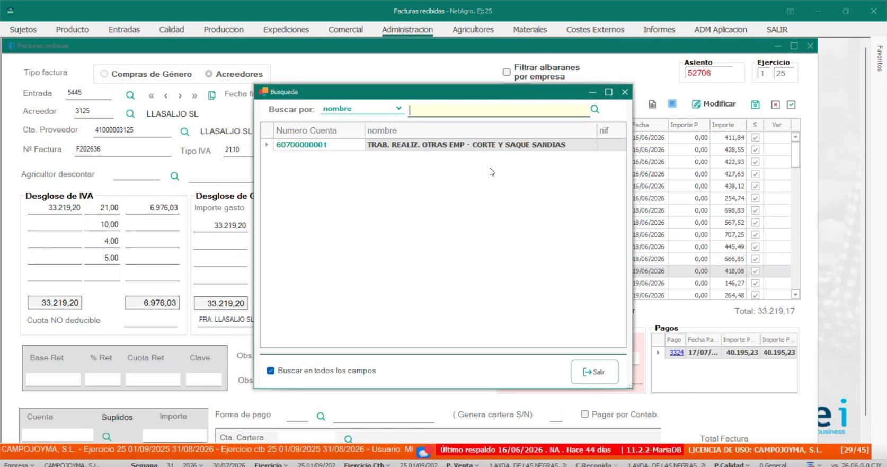

[Fotograma bruto 1920×1080](fotogramas-pantalla-completa/05-13m39-buscador-cuentas-gasto.png) ·
[Teams y transcripción asociada](05-13m39-buscador-cuentas-gasto.png).

El buscador permite introducir un prefijo y seleccionar una cuenta concreta.
La decisión sigue siendo humana cuando el proveedor admite más de una
naturaleza contable.

### 17:08–17:13 — Consulta de facturas por proveedor

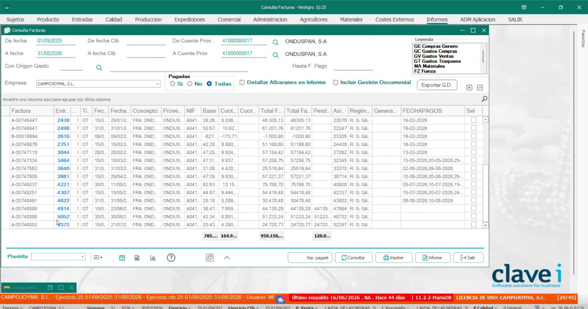

[Fotograma bruto 1920×1080](fotogramas-pantalla-completa/06-17m08-consulta-facturas-proveedor-onduspan.png) ·
[Teams y transcripción asociada](06-17m13-consulta-facturas-proveedor.png).

La factura terminada en `886` se localiza después de identificar al proveedor
Onduspan. En el listado se señala la Entrada `5052`.

### 19:20–19:27 — Soporte del descuento especial

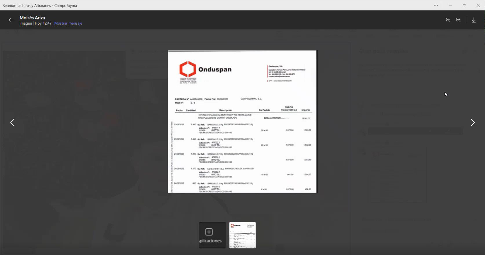

[Fotograma bruto 1920×1080](fotogramas-pantalla-completa/07-19m20-soporte-documental-factura-onduspan.png) ·
[Teams y transcripción asociada](10-19m27-soporte-factura-onduspan-descuento-3pct.png).

Este fotograma no es una ventana de Netagro: es el documento compartido para
explicar por qué los importes de albarán no coincidían antes de aplicar el
descuento. Se conserva porque justifica la regla particular del 3 %.

### 21:25–21:33 — Punteo de albaranes `MA` y control de total

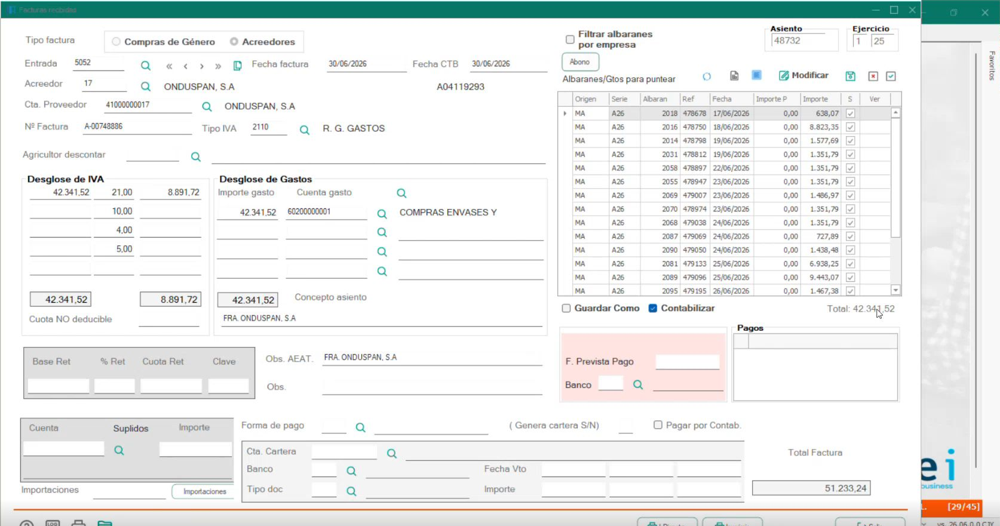

[Fotograma bruto 1920×1080](fotogramas-pantalla-completa/08-21m25-onduspan-punteos-ma-control-total.png) ·
[Teams y transcripción asociada](07-21m33-factura-onduspan-punteos-ma-y-control-total.png).

La suma inferior de la rejilla se usa como control contra la primera base del
IVA. Una diferencia no debe corregirse de forma automática: dispara revisión.

### 22:13–22:17 — Detalle de un albarán de materiales

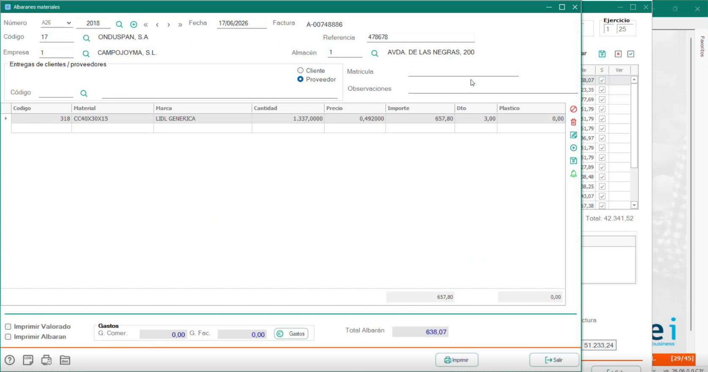

[Fotograma bruto 1920×1080](fotogramas-pantalla-completa/09-22m13-detalle-albaran-materiales.png) ·
[Teams y transcripción asociada](08-22m17-albaran-materiales-detalle-y-descuento.png).

Se ve la cabecera del proveedor, la referencia y su línea de material. La
explicación aclara que estos movimientos se registran diariamente en esta otra
pantalla y después se seleccionan al confeccionar la factura.

### 23:26–23:27 — Contabilizar

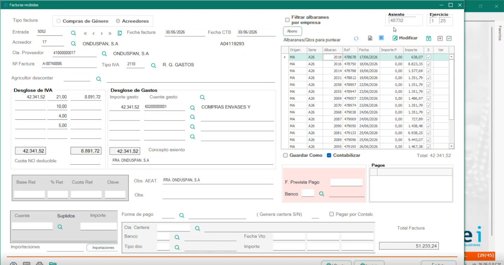

[Fotograma bruto 1920×1080](fotogramas-pantalla-completa/10-23m26-contabilizar-y-asiento.png) ·
[Teams y transcripción asociada](09-23m27-contabilizar-traspaso-gestion-contabilidad.png).

La casilla aparece marcada en una factura existente. La transcripción confirma
que guardar así crea el asiento y que el número visible arriba permite
comprobar el registro contable.

## Preguntas que la reunión deja abiertas

1. Qué acción, procedimiento o servicio interno oficial realiza el traspaso y
   devuelve el identificador del asiento a una integración externa.
2. Qué regla exacta debe calcular `Fecha CTB`: fecha de recepción, fecha de
   registro, fecha de envío al SII u otra fecha elegida por el operador.
3. Si se permite guardar una factura sin contabilizar en la operativa normal y
   cómo se reconoce posteriormente ese estado.
4. Diccionario oficial de códigos de origen (`MA`, `GC`, `GE`, `ASG`, `FGC`,
   etc.) y qué pantalla da de alta cada familia.
5. Identidad ERP exacta del proveedor al que se aplica el 3 %, base del
   descuento y regla de redondeo por línea.
6. Si la propuesta general de cuenta `60200000001` debe limitarse a materiales
   o a proveedores concretos en vez de aplicarse como regla amplia.
7. Tratamiento de duplicados, abonos, descuadres bloqueantes, pagos y
   vencimientos: no se demostró en esta grabación.

## Integridad de los ficheros

### Capturas originales de Teams con transcripción

| Fichero | SHA-256 |
|---|---|
| `01-06m10-factura-recibida-tipos-compra-y-acreedor.png` | `55372d46576e2fa1a41758bf44fbc348615c495a2204579a34dde25d5c14c074` |
| `02-07m27-acreedor-materiales-con-albaran.png` | `b3b8ea764bd1c961ad4d114089622ffbd2c43d2e1e62c6a9b33abfc66e66779e` |
| `03-08m13-acreedor-con-multiples-gastos-gc.png` | `a49ca644f08644fda01058758af7ad7b165c97320d8cccc8bf68e77435189f33` |
| `04-11m22-visualizador-asiento-contable.png` | `bae43d9aaea0e03200aff6ef93abe28d57adf8061ec60c243feacfbf32870564` |
| `05-13m39-buscador-cuentas-gasto.png` | `964149e77ee987ca5a3d780fbac646e315070261be9148d5d715e1636c77bb4f` |
| `06-17m13-consulta-facturas-proveedor.png` | `a07736b392bc5868b0db0f2a02a58587155597a8a3967c9f45fc07ef763c8b73` |
| `07-21m33-factura-onduspan-punteos-ma-y-control-total.png` | `a830cb38c9743f6689c056dea80b7fd5a4898b47b82bcdef289a215a9c0c9b9b` |
| `08-22m17-albaran-materiales-detalle-y-descuento.png` | `2b4786facb412db38e64e07e02155170c7c0625e38dcb64e0534eb7f9933a70f` |
| `09-23m27-contabilizar-traspaso-gestion-contabilidad.png` | `fb6e2b7b550ff436713466298d734310bfeeeb95d532621d5a112760f52350a2` |
| `10-19m27-soporte-factura-onduspan-descuento-3pct.png` | `6b8e86385e082358902fb13d901665967711ce3be010a6d701a1d2e5ea907b2b` |

Las huellas de los diez fotogramas brutos y sus diez derivados limpios se
conservan en
[`MANIFIESTO_PANTALLA_COMPLETA.md`](MANIFIESTO_PANTALLA_COMPLETA.md).
